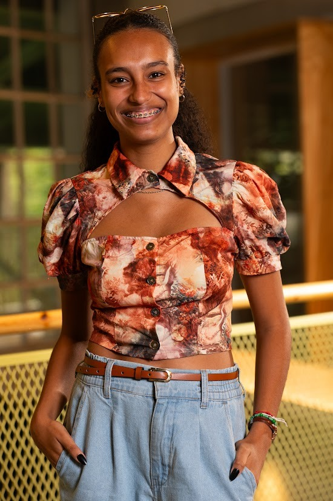
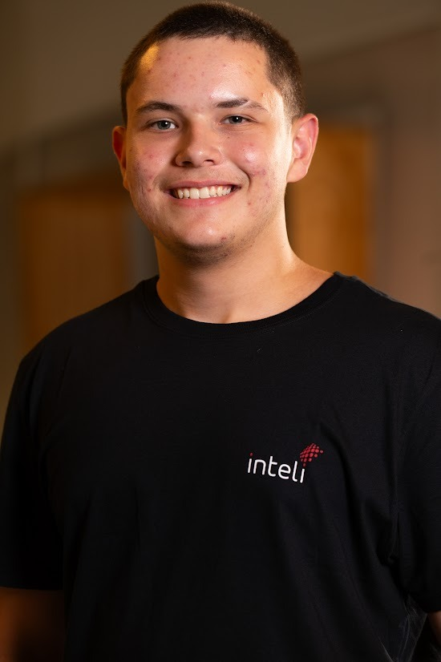
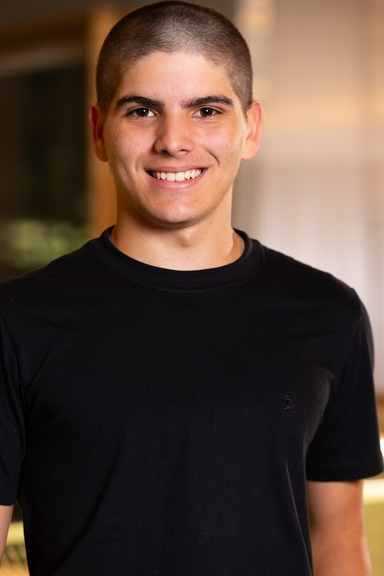
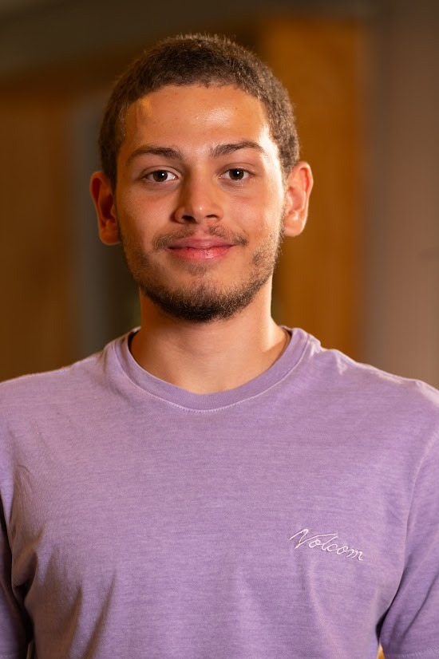
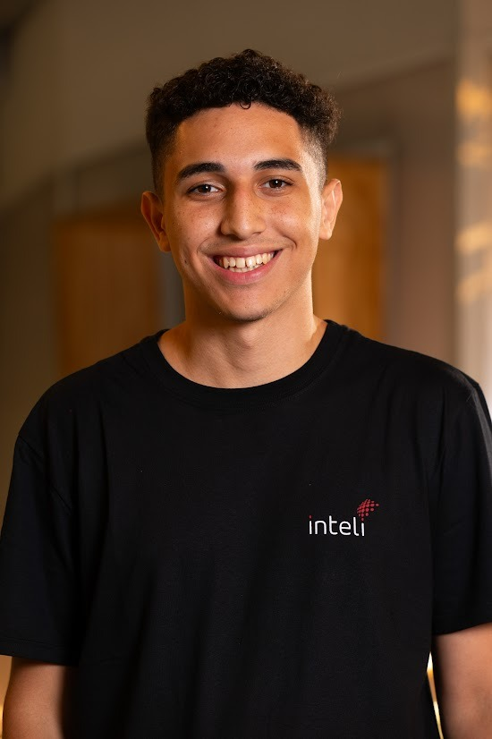
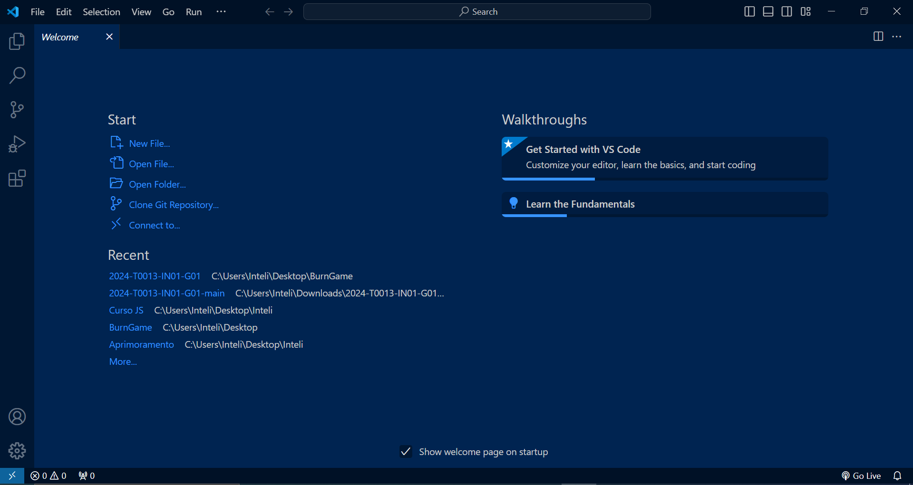
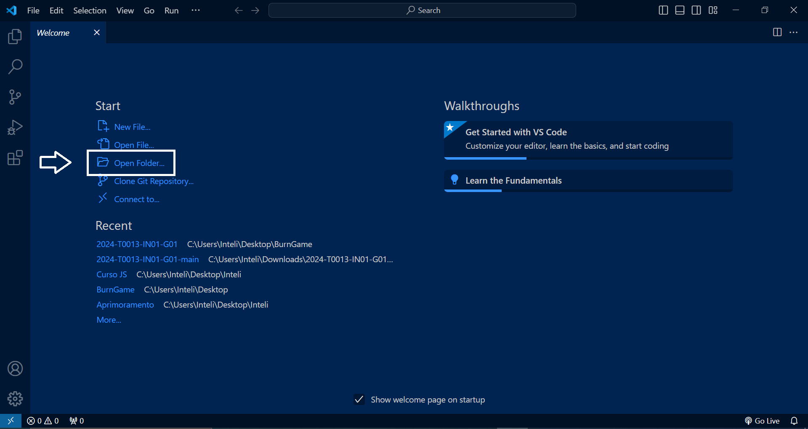
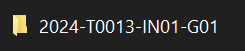
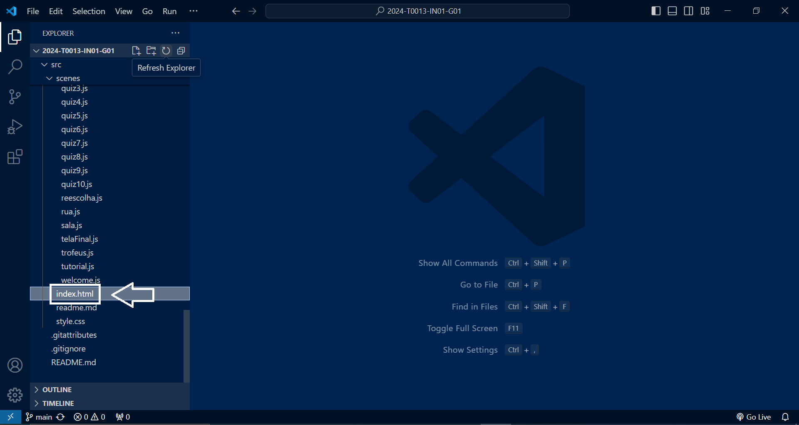

# Inteli - Instituto de Tecnologia e Liderança 

<p align="center">
<a href= "https://www.inteli.edu.br/"></a>
</p>
<br>

## 👨‍🎓 Integrantes:

<div align="center">
<table>
  <tr>
    <td align="center">
      <a href="https://www.linkedin.com/in/cibele-leal-73a137235/">
        <br>
        <sub>
          <b>Cibele Figueredo Leal</b>
        </sub>
      </a>
    </td>
    <td align="center">
      <a href="https://www.linkedin.com/in/mbepplerp/">
        <br>
        <sub>
          <b>Mateus Beppler Pereira</b>
        </sub>
      </a>
    </td>
  <td align="center"> 
      <a href="https://www.linkedin.com/in/mirella-borim-a2b32a278/">
        <br>
        <sub>
          <b>Mirella Borim Lima</b>
        </sub>
      </a>
    </td>
    <td align="center">
      <a href="https://www.linkedin.com/in/paulo-henrique-ribeiro-5b8794243/">
        <br>
        <sub>
          <b>Paulo Henrique Ribeiro</b>
        </sub>
      </a>
    </td>
    <td align="center">
      <a href="https://www.linkedin.com/in/pedro-pinheiro-rodrigues-b129b62b7/">
        <br>
        <sub>
          <b>Pedro Pinheiro Rodrigues</b>
        </sub>
      </a>
    </td>
  </tr>
</table>
</div>
<div align="center">
<table>
  <tr>
    </td>
    <td align="center">
      <a href="https://www.linkedin.com/in/roberto-dbf/">
        <br>
        <sub>
          <b>Roberto Diniz Branco Filho</b>
        </sub>
      </a> 
    </td>
    <td align="center">
      <a href="https://www.linkedin.com/in/viniciussavian/">
        <br>
        <sub>
          <b>Vinicius Savian</b>
        </sub>
      </a>
    </td>
  </tr>
</table>
</div>

# Zênite

## Burn Game

<div align="center"></div>

## 👩‍🏫 Professores:
### Orientador(a) 
- <a href="https://www.linkedin.com/in/profclaudioandre/">Cláudio Fernando André</a>
### Instrutores
- <a href="https://www.linkedin.com/in/andre-godoi-chiovato-83730228/">André Godoi</a> 
- <a href="https://www.linkedin.com/in/cristiano-benites-687647a8/">Cristiano Benites</a>
- <a href="https://www.linkedin.com/in/egondaxbacher/">Egon Daxbacher</a>
- <a href="https://www.linkedin.com/in/henrique-mohallem-paiva-6854b460/">Henrique Paiva</a>
- <a href="https://www.linkedin.com/in/juliastateri/">Julia Stateri</a> 

## 📜 Descrição

&nbsp;&nbsp;&nbsp;&nbsp; Projeto feito por alunos do Inteli —Instituto de Tecnologia e Liderança— em parceria com a FMUSP —Faculdade de Medicina da USP. Em primeira análise, as queimaduras representam uma grave ameaça a saúde pública global, afetando principalmente a população em estado de vulnerabilidade. Muitas vezes, esse problema é intensificado pela falta de conhecimento sobre o tema e a disseminação de mitos e práticas inadequadas. <br/>
&nbsp;&nbsp;&nbsp;&nbsp; O projeto se trata de um jogo que aborda a temática das queimaduras com o intuito de conscientização, por meio de um *quiz*. Esse *quiz* aborda situações-problema com *storytelling* da vítima e, a partir disso, apresenta perguntas que testem o conhecimento do jogador. Além disso, como o propósito do projeto é didático, o jogo também apresenta explicações e conceitos que auxiliem na prevenção e cuidados pré-médicos a queimaduras.


- <a href="https://inteli-college.github.io/2024-T0013-IN01-G01/">Link para o jogo</a> 


## 📁 Estrutura de pastas

Dentre os arquivos e pastas presentes na raiz do projeto, definem-se:

- <b>assets</b>: aqui estão os arquivos relacionados a elementos não-estruturados deste repositório, como imagens.

- <b>document</b>: aqui estão todos os documentos do projeto, como o Game Development Document (GDD) bem como documentos complementares, na pasta "other".

- <b>src</b>: Todo o código fonte criado para o desenvolvimento do projeto do jogo.

- <b>README.md</b>: arquivo que serve como guia e explicação geral sobre o projeto e o jogo (o mesmo que você está lendo agora).

- <b>index.html</b>: Esse arquivo habilida o Github Pages.

## 🔧 Como executar o código


### Requisitos do sistema
* Node.js 20.11.1
* Visual Studio Code 1.87
* Extensão Live Server do Visual Studio Code
* Biblioteca Phaser.js 3.23.0 <br>

### Instalação
<ol>
   <li>Clone e faça download deste repositório:</li><br>
   
```sh
git clone https://github.com/Inteli-College/2024-T0013-IN01-G01
```

   <li>Instale o Visual Studio Code 1.87, disponível no link: <link>https://code.visualstudio.com/</link> </li><br>
   <li>Instale o Node.js 20.11.1, disponível no link: <link>https://nodejs.org/en</link> </li><br>  
   <li>Baixe a extensão "Live Server" dentro do Visual Studio Code</li>
</ol>


### Instruções de execução
<ol>
   <strong><li>Abra o Visual Studio Code 1.87</li> </strong>
    

   <strong><li>Clique em "Open Folder..."</li> </strong>
    

   <strong><li>Selecione a pasta "2024-T0013-IN01-G01"</li>   </strong>
    

   <strong><li>Clique com o botão direito em "index.html" e selecione "Open with Live Server"</li> </strong>
    
</ol>

## 🗃 Histórico de lançamentos

* 0.5.0 - 29/03/2024
  
* 0.4.0 - 15/03/2024
  
* 0.3.0 - 01/03/2024
  
* 0.2.0 - 17/02/2024

* 0.1.0 - 03/02/2024
    

## 📋 Licença/License

<p xmlns:cc="http://creativecommons.org/ns#" xmlns:dct="http://purl.org/dc/terms/"><a property="dct:title" rel="cc:attributionURL" href="https://github.com/Inteli-College/2024-T0013-IN01-G01">BURN GAME</a> by <a rel="cc:attributionURL dct:creator" property="cc:attributionName" href="https://www.inteli.edu.br/">Inteli</a>, <a rel="cc:attributionURL dct:creator" property="cc:attributionName" href="https://www.linkedin.com/in/cibele-leal/">Cibele Figueredo Leal</a>, <a rel="cc:attributionURL dct:creator" property="cc:attributionName" href="https://www.linkedin.com/in/mbepplerp/">Mateus Beppler Pereira</a>, <a rel="cc:attributionURL dct:creator" property="cc:attributionName" href="https://www.linkedin.com/in/mirellaborim/">Mirella Borim Lima</a>, <a rel="cc:attributionURL dct:creator" property="cc:attributionName" href="https://www.linkedin.com/in/paulo-henrique-ribeiro-5b8794243/">Paulo Henrique Ribeiro</a>, <a rel="cc:attributionURL dct:creator" property="cc:attributionName" href="https://www.linkedin.com/in/pedro-pinheiro-rodrigues-b129b62b7/">Pedro Pinheiro Rodrigues</a>, <a rel="cc:attributionURL dct:creator" property="cc:attributionName" href="https://www.linkedin.com/in/roberto-dbf/">Roberto Diniz Branco Filho</a>, <a rel="cc:attributionURL dct:creator" property="cc:attributionName" href="https://www.linkedin.com/in/viniciussavian/  ">Vinicius dos Reis Savian</a> is licensed under <a href="http://creativecommons.org/licenses/by/4.0/?ref=chooser-v1" target="_blank" rel="license noopener noreferrer" style="display:inline-block;">Attribution 4.0 International</a>.</p>


