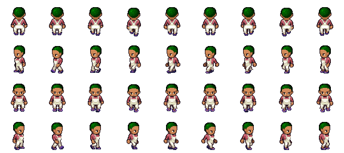
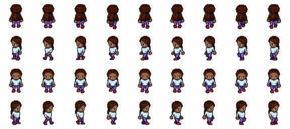
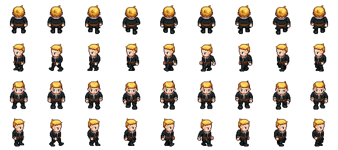
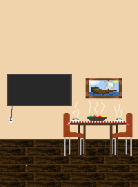
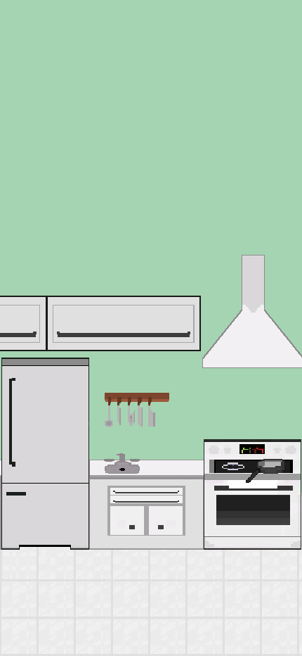
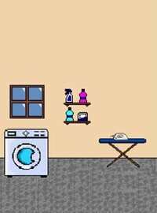
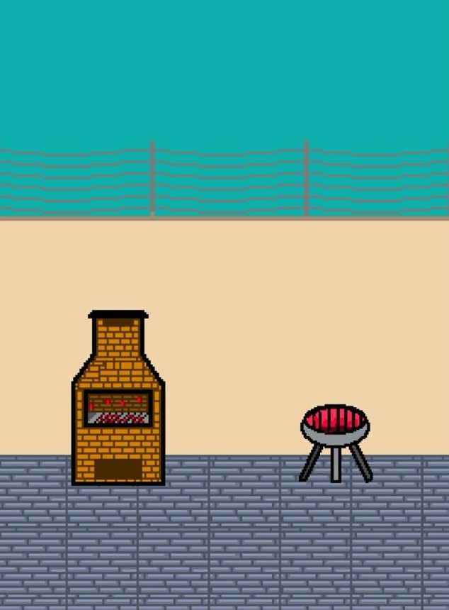
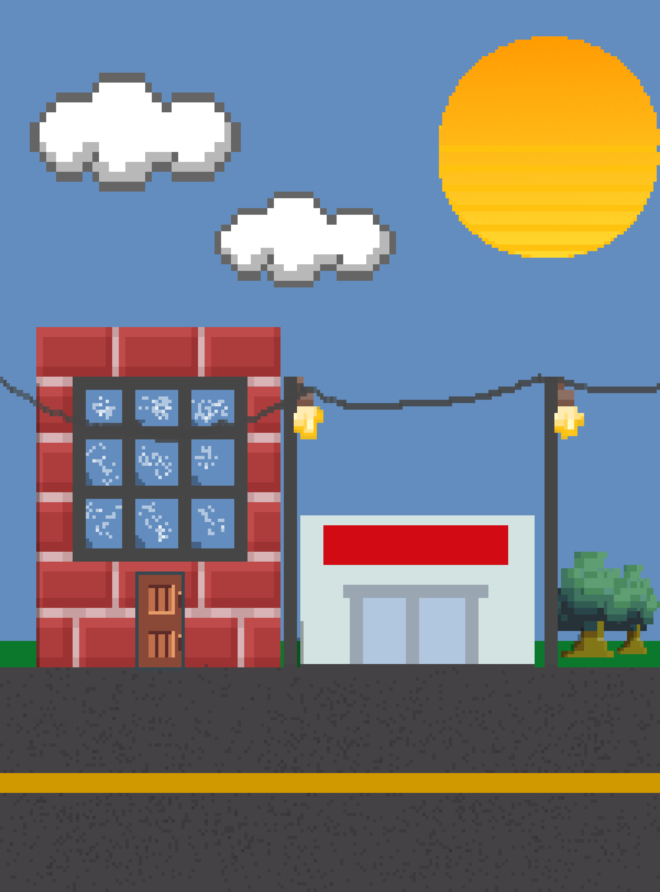
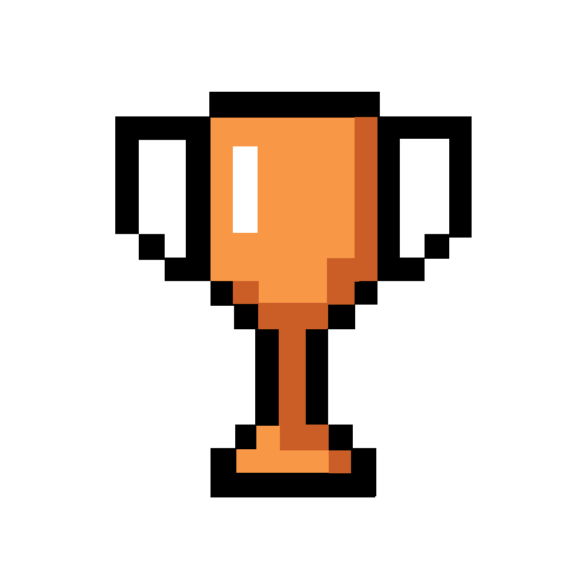
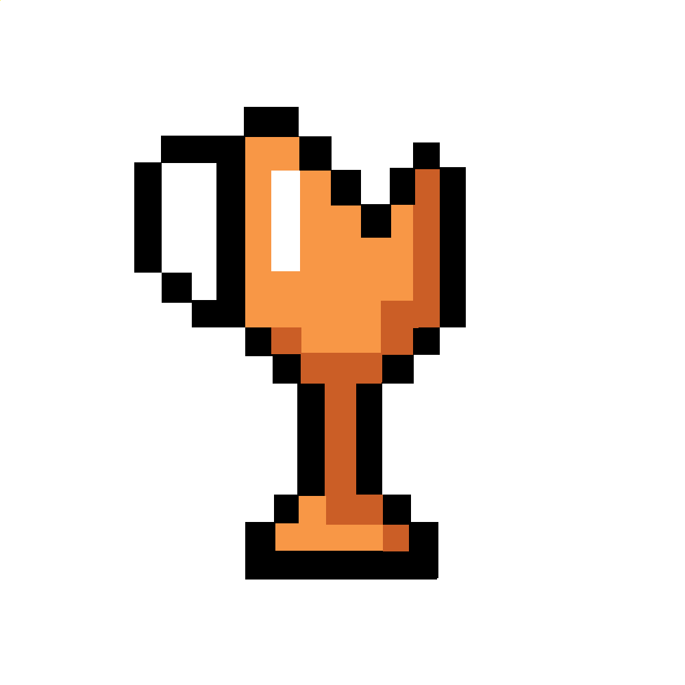

# GDD - Game Design Document - Módulo 1 - Inteli

## Zênite

## 👨‍🎓 Integrantes: 

<table>
  <tr>
    <td align="center">
      <a href="https://www.linkedin.com/in/cibele-leal-73a137235/">
         
        
          <b>Cibele Figueredo Leal</b>
        
      </a>
    </td>
    <td align="center">
      <a href="https://www.linkedin.com/in/mbepplerp/">
         
        
          <b>Mateus Beppler Pereira</b>
        
      </a>
    </td>
  <td align="center"> 
      <a href="https://www.linkedin.com/in/mirella-borim-a2b32a278/">
         
        
          <b>Mirella Borim Lima</b>
        
      </a>
    </td>
    <td align="center">
      <a href="https://www.linkedin.com/in/paulo-henrique-ribeiro-5b8794243/">
         
        
          <b>Paulo Henrique Ribeiro</b>
        
      </a>
    </td>
    <td align="center">
      <a href="https://www.linkedin.com/in/pedro-pinheiro-rodrigues-b129b62b7/">
         
        
          <b>Pedro Pinheiro Rodrigues</b>
        
      </a>
    </td>
  </tr>
</table>

<table>
  <tr>
    </td>
    <td align="center">
      <a href="https://www.linkedin.com/in/roberto-dbf/">
         
        
          <b>Roberto Diniz Branco Filho</b>
        
      </a> 
    </td>
    <td align="center">
      <a href="https://www.linkedin.com/in/viniciussavian/">
         
        
          <b>Vinicius Savian</b>
        
      </a>
    </td>
  </tr>
</table>

## Sumário

[1. Introdução](#c1)

[2. Visão Geral do Jogo](#c2)

[3. Game Design](#c3)

[4. Desenvolvimento do jogo](#c4)

[5. Casos de Teste](#c5)

[6. Conclusões e trabalhos futuros](#c6)

[7. Referências](#c7)

[Anexos](#c8)

 

# 1. Introdução

## 1.1. Escopo do Projeto

### 1.1.1. Contexto da indústria
&nbsp;&nbsp;&nbsp;&nbsp; No Brasil, o mercado dos cursos de medicina é marcado pela presença dominante das faculdades públicas, que atraem candidatos pela qualidade do ensino, reconhecimento no mercado de trabalho e internacionalização. Nas últimas décadas, houve um aumento significativo no número de faculdades de medicina e de vagas oferecidas, impactando a qualidade do ensino e a formação dos profissionais. Devido à alta concorrência por vagas em faculdades públicas, as particulares têm sido bastante procuradas, oferecendo abordagens modernas, qualidade de ensino e programas de bolsas ou financiamentos estudantis para tornar o curso mais acessível. Com mais de 960 mil inscritos disputando apenas 47 mil vagas em cursos de graduação de medicina em 2022, os candidatos se tornam clientes em potencial do mercado das faculdades de medicina, buscando não apenas uma formação acadêmica, mas também uma experiência educacional que atenda às suas expectativas e necessidades.

&nbsp;&nbsp;&nbsp;&nbsp;Uma ferramenta qualificada para aprofundar a contextualização da indústria é as 5 Forças de Porter que fornece uma visão abrangente da dinâmica competitiva enfrentada pelas faculdades de medicina no Brasil. Uma dessas forças é o poder de negociação dos fornecedores. No mercado das faculdades de medicina, os fornecedores desempenham um papel essencial na oferta de recursos e serviços essenciais para o funcionamento dessas instituições. Nesse meio, existem fornecedores com grande e outros com baixo poder de negociação. Por exemplo, os fornecedores de produtos médicos simples, como bandagens e seringas, têm pouco poder de negociação devido à ampla disponibilidade desses produtos no mercado, o que leva a uma concorrência maior entre os fornecedores. Por outro lado, os fornecedores de equipamentos sofisticados para exames possuem um número limitado de concorrentes, o que faz com que o seu poder de negociação seja alto. Esses fornecedores incluem empresas de tecnologia e fornecedores de equipamentos médicos, bem como editoras de livros e empresas de transporte e alimentação. Cada um desses fornecedores desempenha um papel importante no fornecimento de recursos e serviços específicos para as faculdades de medicina, contribuindo para o seu funcionamento eficaz.

&nbsp;&nbsp;&nbsp;&nbsp;Outra força relevante é o poder de barganha dos clientes. Com mais de 960 mil candidatos disputando apenas 47 mil vagas em cursos de graduação de medicina em 2022, fica evidente a alta demanda e competitividade acirrada por uma vaga nessas instituições. Além disso, a USP é reconhecida como uma das melhores faculdades de medicina do Brasil, o que resulta na falta de alternativas equivalentes em termos de qualidade e reconhecimento. O cenário competitivo das faculdades de medicina no Brasil, especialmente na USP, limita as opções dos vestibulandos, que enfrentam uma concorrência acirrada. A USP mantém uma quantidade limitada de vagas por ano e não pretende aumentá-la, mantendo o vestibular mais concorrido do país, onde apenas os melhores estudantes são aprovados.

&nbsp;&nbsp;&nbsp;&nbsp;A entrada de novos competidores no mercado das faculdades de medicina pode representar uma ameaça, sendo que esses novos entrantes podem incluir desde instituições de ensino já estabelecidas que buscam expandir suas operações até empresas de educação e startups que oferecem modelos de ensino disruptivos. No entanto, esse mercado é caracterizado por barreiras significativas à entrada, tais como requisitos regulatórios rigorosos, altos custos de infraestrutura, necessidade de construir credibilidade e reputação, acesso limitado a professores e recursos qualificados, exigências de financiamento substanciais e a forte concorrência com instituições já estabelecidas. Essas barreiras dificultam o interesse e o investimento de novos participantes nesse setor.

&nbsp;&nbsp;&nbsp;&nbsp;A rivalidade entre concorrentes no mercado das faculdades de medicina é intensa, evidenciada pela alta demanda por vagas e pela competição acirrada entre instituições públicas e privadas. Nesse cenário, as faculdades de medicina, incluindo a USP, buscam se diferenciar pela qualidade do ensino, pela oferta de serviços e pela capacidade de se adaptar às demandas dos candidatos e do mercado de trabalho. Para a USP, isso significa manter um padrão de excelência no ensino, formar profissionais altamente qualificados e promover a constante inovação, a fim de se manter competitiva no mercado educacional.

&nbsp;&nbsp;&nbsp;&nbsp;Por fim, o contexto das faculdades de medicina no Brasil destaca a intensa competição entre as instituições, a relevante ameaça de novos entrantes, o poder de negociação dos fornecedores e a influência dos estudantes como clientes. Esses fatores evidenciam a necessidade de estratégias bem elaboradas para se destacar em um mercado dinâmico e altamente competitivo, onde a qualidade do ensino, a oferta de serviços e a capacidade de adaptação às demandas do mercado são importantes para o sucesso das instituições de ensino médico. 

[Link para leitura do template 5 forças de porter](https://www.canva.com/design/DAF_-a3bvD0/vwgfzCIyH0ZKXCVnZscW3g/edit?utm_content=DAF_-a3bvD0&utm_campaign=designshare&utm_medium=link2&utm_source=sharebutton)

  Figura 1 — Prévia do template das 5 Forças de Porter 
  
Fonte: Material produzido pelos autores (2024). 
  

### 1.1.2. Análise SWOT

&nbsp;&nbsp;&nbsp;&nbsp;De acordo com Casarotto (2019), a análise SWOT é uma ferramenta de marketing para avaliar o cenário da construção de uma empresa e embasar tomadas de decisões. Fornece o diagnóstico completo da situação da própria empresa e dos ambientes ao seu entorno. Forças e fraquezas se referem a análise interna, enquanto oportunidades e ameaças se referem a uma análise do ambiente externo. A análise do ambiente externo pode englobar uma análise de mercado, concorrentes, fornecedores e até o ambiente político, econômico, social e cultural. Dentro do ambiente interno, pode ser possível analisar a localização, o tempo de mercado, os recursos financeiros, os recursos humanos, a capacidade de operação, etc. Na Figura 2, apresentamos a análise SWOT centrada na FMUSP.

  Figura 2 — Análise SWOT 
  
Fonte: Material produzido pelos autores (2024). 
  

&nbsp;&nbsp;&nbsp;&nbsp;Com a análise SWOT é possível entender diversos pontos sobre o projeto e principalmente sobre o Hospital de Medicina da USP. Podemos, ainda, estabelecer relações entre os fatores internos e externos, como:

**1. Renome Internacional (Força) e Ampliação da Internacionalização (Oportunidade):**
* O renome internacional da FMUSP pode ser aproveitado como uma base sólida para expandir suas parcerias e programas internacionais, promovendo ainda mais sua reputação global.

**2. Excelência Acadêmica (Força) e Competição Acadêmica (Ameaça):**
* A excelência acadêmica da FMUSP a posiciona favoravelmente no mercado, mas também a torna alvo da competição com outras instituições de ensino e pesquisa que buscam atrair estudantes e financiamento para projetos. Por enquanto, a relevância da faculdade parece ter sido suficiente para superar a concorrência.

**3. Parcerias Estratégicas (Força) e Mudanças Regulatórias (Ameaça):**
* As parcerias estratégicas da FMUSP podem ajudar a enfrentar mudanças regulatórias, já que alianças com outras instituições e organizações podem proporcionar recursos adicionais e conhecimentos necessários para se adaptar às novas regulamentações.

**4. Sobrecarga de Demandas (Fraqueza) e Escassez de Recursos Humanos (Ameaça):**
* A sobrecarga de demandas na FMUSP pode ser agravada pela escassez de recursos humanos qualificados. A falta de pessoal pode tornar ainda mais difícil atender às necessidades da instituição e manter os padrões de excelência.

**5. Burocracia Institucional (Fraqueza) e Instabilidade Política e Econômica (Ameaça):**
* A burocracia institucional pode tornar a FMUSP mais suscetível à instabilidade política e econômica, já que processos lentos e falta de agilidade podem dificultar a adaptação rápida às mudanças externas.

**6. Limitações Orçamentárias (Fraqueza) e Demanda por Saúde e Pesquisa (Oportunidade):**
* Apesar das limitações orçamentárias, a crescente demanda por serviços de saúde e pesquisa oferece à FMUSP a oportunidade de buscar financiamento adicional por meio de parcerias público-privadas, doações e outras fontes de receita.

&nbsp;&nbsp;&nbsp;&nbsp;Essas relações destacam como os fatores internos e externos podem influenciar e interagir entre si, impactando o ambiente operacional e estratégico da FMUSP. É importante compreender a dinâmica desses fatores para implementar medidas eficazes de gerenciamento de riscos e manter a resiliência organizacional frente às adversidades.

### 1.1.3. Descrição da Solução Desenvolvida
**Qual é o problema a ser resolvido?** 

&nbsp;&nbsp;&nbsp;&nbsp;De acordo com a proposta desenvolvida pela Faculdade de Medicina da USP (FMUSP), a solução deve atenuar a falta de conhecimento sobre a prevenção e primeiros socorros em situação de queimaduras, além de combater a disseminação de falsas informações sobre o assunto.

**Quais os dados disponíveis?** 
* Cartilha para Tratamento de Emergência das Queimaduras fornecida pela FMUSP;
* Apresentação: Início do Projeto - Burn Game [fornecida pela FMUSP];
* Manual de Queimaduras para Estudantes [fornecido pela FMUSP];
* FMUSP-INTELI-TAPI-MOD1-GAME-2024-V2.[fornecido pela FMUSP]
* Kahoot - Burn Game [fornecido pela FMUSP]

**Qual a solução proposta?**

&nbsp;&nbsp;&nbsp;&nbsp; A solução proposta para abordar a falta de conhecimento sobre prevenção e primeiros socorros em casos de queimaduras é um jogo educativo com mecânica de quiz, ou seja, validar o conhecimento do jogador através de perguntas e respostas. Há também o recurso de seleção do personagem, o que faz com que o jogador consiga se identificar e se apegar emocionalmente.

&nbsp;&nbsp;&nbsp;&nbsp;O jogo desafia os jogadores com perguntas de múltipla escolha sobre o tema, como identificar tipos de queimaduras ou a conduta correta ao lidar com uma vítima e com o estímulo de um cronômetro que os incentiva a responder cada vez mais rápido para ter o melhor tempo possível. Cada resposta correta acumula troféus e permite avançar para os próximos níveis. Para tornar a experiência mais envolvente, o jogo inclui pequenos storytelling relacionados às perguntas. Essas histórias contextualizam as perguntas e ajudam os jogadores a entender melhor os conceitos apresentados.

&nbsp;&nbsp;&nbsp;&nbsp;Após cada resposta, o jogo fornece _feedback_ imediato, explicando a resposta correta e oferecendo informações adicionais sobre o tema. Além disso, os jogadores recebem troféus, com um sistema que permite consultar o troféu conquistado em cada nível e tentar conquistar um troféu melhor ao rejogar a fase. O jogo possui 4 tipos diferentes de troféus: ouro, que pode ser conquistado ao responder corretamente a pergunta dentro de 20 segundos, prata, que pode ser conquistado ao responder corretamente a pergunta dentro de 30 segundos, bronze, que pode ser conquistado ao responder corretamente a pergunta dentro de 10 segundos e quebrado, que pode ser conquistado ao não responder a pergunta até o fim do cronômetro ou ao responder incorretamente. Cada um deles possui um peso diferente que ao final do jogo será somado para gerar um percentual final que será a nota acumulada do jogador. 

&nbsp;&nbsp;&nbsp;&nbsp;Destinado a estudantes do Ensino Médio, o jogo busca engajar esse público na aprendizagem sobre prevenção de queimaduras. Através dessa abordagem lúdica e educativa, a FMUSP pretende disseminar informações corretas e conscientizar sobre a importância dos primeiros socorros em situações de emergência, contribuindo para a redução de acidentes e o aumento da segurança da população.

**Como a solução proposta deverá ser utilizada?** 

&nbsp;&nbsp;&nbsp;&nbsp;Após a apresentação desenvolvida pela FMUSP nas escolas públicas, o jogo será disponibilizado para os alunos acessarem através de seus _smartphones_, podendo jogar em qualquer lugar, inclusive na sala de aula. Visando não apenas informar, mas também engajar os alunos de maneira lúdica e eficaz. A proposta é que o jogo seja uma ferramenta complementar ao aprendizado, permitindo que os alunos testem seus conhecimentos e reforcem os conceitos apresentados na palestra, incentivando a adoção de medidas preventivas no dia a dia.

**Quais os benefícios trazidos pela solução proposta?**

&nbsp;&nbsp;&nbsp;&nbsp;A integração do jogo na palestra sobre prevenção de queimaduras traz uma série de benefícios significativos. O jogo oferece um ambiente interativo e divertido para aprender, aumentando o engajamento dos alunos e facilitando a absorção das informações. Isso pode resultar em um aprendizado mais efetivo e duradouro. Além disso, o jogo tem potencial para ser compartilhado entre os alunos e além do público-alvo, aumentando assim o alcance das informações sobre prevenção de queimaduras. Os estudantes podem se tornar agentes de disseminação das informações, compartilhando o jogo e os conhecimentos adquiridos com amigos, familiares e colegas de escola. Essa disseminação das informações pode contribuir para a conscientização e adoção de medidas preventivas não apenas pelos alunos, mas também por suas redes de contato. Como consequência, prevê-se a redução da quantidade de casos de queimaduras no Brasil, tornando o jogo um apoio valioso para as ações da FMUSP e para a promoção da saúde pública.

**Qual será o critério de sucesso e qual medida será utilizada para o avaliar?**

&nbsp;&nbsp;&nbsp;&nbsp;Primeiramente, o engajamento dos alunos será um ponto-chave, medido pela quantidade de alunos que jogam o jogo e a frequência com que o fazem. Além disso, o _feedback_ dos alunos será essencial, avaliando sua percepção sobre a experiência de jogar o jogo e sua relevância para aprender sobre prevenção de queimaduras. Outro indicador importante será a disseminação das informações, verificando o compartilhamento do jogo e das informações sobre prevenção de queimaduras pelos alunos em suas redes sociais e pessoais. Por fim, embora seja um indicador de longo prazo e sujeito a diversas variáveis, a redução da quantidade de casos de queimaduras no Brasil será um indicativo do impacto positivo da iniciativa.

### 1.1.4. Proposta de Valor

&nbsp;&nbsp;&nbsp;&nbsp;O Canvas de Proposta de Valor é dividido em duas partes: o Perfil do Cliente e o Mapa de Valor. O Perfil do Cliente é dividido em três partes: as tarefas, as dores e os ganhos. As tarefas são ações que o cliente deseja realizar, tanto concretas quanto abstratas, enquanto as dores são obstáculos, frustrações ou riscos, e, por fim, os ganhos são consequências positivas. O mapa de valor, por sua vez, é dividido em três partes: o produto ou o serviço que a empresa oferece, como ele reduz ou elimina as dores do cliente e como ele produz ou intensifica os ganhos esperados pelo público.

&nbsp;&nbsp;&nbsp;&nbsp; Na figura a seguir, apresentamos o Canvas de Proposta de Valor para identificar as informações essenciais para o projeto. Com esses dados, conseguimos criar o planejamento do jogo, alinhado com o nosso público e congruente às suas necessidades.

Figura 3 — Canvas da Proposta de Valor  

Fonte: Material produzido pelos autores (2024).

 

&nbsp;&nbsp;&nbsp;&nbsp;A introdução do Canvas na nossa abordagem revelou aspectos importantes que demandavam atenção imediata para melhor servir aos nossos clientes. Identificamos duas dores específicas que se destacaram entre as demais: a falta de conhecimento abrangente sobre queimaduras e a carência de atratividade do conteúdo oferecido. A compreensão dessas questões aliada à análise detalhada de todos os elementos presentes no Canvas nos permitiu conceber uma solução inovadora e eficaz. Nossa resposta a essas necessidades foi a criação de um jogo dinâmico e educativo, meticulosamente projetado para abordar e solucionar as duas principais preocupações identificadas.

### 1.1.5. Matriz de Riscos

&nbsp;&nbsp;&nbsp;&nbsp;A Matriz de Risco ou Matriz de Probabilidade e Impacto é uma ferramenta de gerenciamento de riscos que cumpre o papel de identificar quais riscos devem receber mais atenção, ela é uma ferramenta dinamica, pois os riscos são dinamicos e são atualizados conforme o desenvolvimento do projeto. Alguns riscos são mais prováveis e impactantes no ínicio do projeto, e outros apenas apresentan-se relevantes com o decorrer do projeto. Sua aplicação deve ser feita na avaliação dos riscos, logo após a etapa de identificação deles.

&nbsp;&nbsp;&nbsp;&nbsp;Por se tratar de uma ferramenta gráfica, ela facilita a compreensão de quais riscos irão afetar a empresa e, a partir disso, possibilita a tomada de decisões e medidas preventivas para tratar esses riscos. Além disso, por ser de fácil compreensão, colabora com o engajamento da equipe no processo da gestão de riscos.

&nbsp;&nbsp;&nbsp;&nbsp;A seguir, apresentamos o histórico da matriz de risco que construímos, incluindo as alterações feitas ao longo do projeto, tendo em vista o seu dinamismo e as diferentes fases de desenvolvimento.

Figura 4 — Matriz de Risco Antiga (Sprint 1)
  
Fonte: Material produzido pelos autores (2024).

Figura 5 — Matriz de Risco Atual (Sprint 4)
  
Fonte: Material produzido pelos autores (2024).

  

&nbsp;&nbsp;&nbsp;&nbsp;No início do projeto, havíamos estabelecido uma matriz de risco assertiva de acordo com o momento que vivíamos na época, pois estávamos no início do projeto. No entanto, ao longo das semanas e com o progresso das _sprints_, alguns riscos ganharam mais relevância, tornando-se mais impactantes. Essa evolução nos alertou para a necessidade de uma revisão contínua da matriz de risco, adaptando-a às mudanças e desafios que surgem durante o desenvolvimento do projeto. Assim, mantemos uma abordagem proativa para mitigar os riscos emergentes e garantir o sucesso do projeto.

&nbsp;&nbsp;&nbsp;&nbsp;Com a matriz de risco elaborada, foi possível traçar alguns planos de ação para mitigar esses riscos e evitar ficarmos reféns da situação. A seguir, apresentamos os planos de ação desenhados para cada risco.

### Plano de ação
**Risco 01**: Não se adequar ao público-alvo
* Tomar conhecimento do público alvo que o cliente deseja atingir por meio dos workshops e reuniões;
* Aliar o desenvolvimento do projeto com os ensinamentos dos  autoestudos de UX Design, para entender as necessidades e o perfil do usuário;

**Risco 02**: Não finalizar o projeto no prazo
* Participação ativa do _scrum master_ para a gestão e o controle do tempo do projeto;
* Aliar o desenvolvimento do projeto com os ensinamentos dos autoestudos das metodologias Ágil e Scrum;

**Risco 03**: Não agradar os parceiros
* Comunicação efetiva e clara com os clientes durante as sprints;
* Alinhar-se às ideias do parceiro, implementando parte das ideias do grupo por meio de sugestões;

**Risco 04**: Erros operacionais no jogo
* Organizar o código de forma clara para facilitar o engajamento da equipe na programação e ajudar na posterior revisão durante o período de testes;
* Criação de protótipos para avaliar o funcionamento do jogo;

**Risco 05**: Erros por falta de planejamento
* Realizar _daily plannings_ e _sprint plannings_ efetivas e distribuir equitativamente as tarefas para os membros do projeto; 
* Aplicar a Metodologia Ágil e Scrum, para aumentar a produtividade e a gestão do tempo;

**Risco 06**: Alterações no escopo do projeto
* Adaptar-se aos imprevistos de forma a minimizar os impactos no andamento do projeto;
* Negociação com o parceiro de projeto com o objetivo de não gerar mudanças bruscas no que já foi desenvolvido. 

**Risco 07**: Desenvolver um jogo sem dificuldade na jogabilidade
* Deixar as perguntas mais difíceis.
* Deixar menos tempo para o jogador responder as perguntas

**Risco 08**: Problemas de compatibilidade
* Aplicar os conceitos de responsividade, dessa forma tornando o projeto compatível em diversos navegadores. 

**Risco 09**: Problemas de desempenho
* Refatoração do código, diminuindo a quantidade de linhas e códigos repetidos, dessa forma aumentando o desempenho do jogo.

**Risco 10**: Pouca acessibilidade
* Adicionar mais personagens, a fim de alcançarmos uma maior representatividade em nosso jogo.

**Risco 11**: Jogo pouco intuitivo
* Adicionarmos tutoriais antes do jogador iniciar o jogo, dessa forma tornando o jogo mais intuitivo ao jogador.

**Risco 12**: Erros por falta de comunicação
* Criar um ambiente seguro para o compartilhamento de ideias, preocupações e _feedbacks_.

**Risco 13**: Conflitos internos dentro da equipe
* Promover uma cultura de valorização e respeito dentro da equipe, estabelecendo canais de resolução de conflitos eficazes.
 

## 1.2. Requisitos do Projeto
&nbsp;&nbsp;&nbsp;&nbsp;Os requisitos do projeto são as especificações ou as condições que o produto final deve atender para satisfazer as necessidades dos usuários. Esses requisitos descrevem as funcionalidades, comportamentos e características que o jogo deve possuir para ser considerado completo e funcional. Assim, estão descritos abaixo os requisitos específicos do nosso projeto.

  Tabela 1 — Requisitos do Projeto 

  \# | Requisito  
--- | ---
1 | O jogo é no estilo quiz;
2 | Na tela inicial, é possível iniciar um novo jogo ou ver as pontuações anteriores;
3 | O jogador realizará os eventos por meio de cliques;
4 | O jogador ganhará pontos a cada pergunta respondida corretamente;
5 | Os pontos são somados e mostrados ao final do jogo;
6 | Em caso de resposta errada, o jogador não ganhará e nem perderá pontos;
7 | Os pontos são somados e mostrados ao final do jogo;
8 | As perguntas possuem um temporizador de 40 segundos para serem respondidas;
9 | Caso o temporizador chegue a zero, a pergunta é considerada como errada;
10| Todas as perguntas possuem uma explicação ao serem respondidas ou ao tempo chegar ao fim.

Fonte: Material produzido pelos autores (2024). 
  

&nbsp;&nbsp;&nbsp;&nbsp;Esses requisitos, quando implementados adequadamente, garantem que o produto final atenda às expectativas dos usuários e proporcione uma experiência de jogo satisfatória.

## 1.3. Público-alvo do Projeto

&nbsp;&nbsp;&nbsp;&nbsp;O público-alvo do nosso jogo serão jovens de 14 a 19 anos, uma vez que as palestras em escolas da FMUSP atingem principalmente esse grupo. Além disso, acreditamos que esses jovens podem ser vetores de transmissão de informações e do próprio jogo.

# 2. Visão Geral do Jogo

## 2.1. Objetivos do Jogo

&nbsp;&nbsp;&nbsp;&nbsp; O jogador se encontrará em uma história com _quiz_ integrado, que funcionará como forma de desafio em momentos-chave para avaliá-lo e possibilitar a progressão da história.

## 2.2. Características do Jogo

### 2.2.1. Gênero do Jogo

&nbsp;&nbsp;&nbsp;&nbsp;O jogo faz parte do gênero de trivia, assim, tem como proposta os jogadores responderem perguntas triviais ou específicas para marcar pontos e vencer. Contudo, visto o objetivo didático do projeto, o jogo também possui elementos educativos, a fim de conscientizar e disseminar informação.

### 2.2.2. Plataforma do Jogo

&nbsp;&nbsp;&nbsp;&nbsp; O jogo será desenvolvido para _smartphone_ e _tablet_, sendo feito para ser reproduzido de forma *web*, sem precisar da instalação de aplicativos, com o objetivo de ser o mais acessível possível, já que queremos atingir a maior parte dos alunos.

### 2.2.3. Número de jogadores

&nbsp;&nbsp;&nbsp;&nbsp; O jogo foi desenvolvido para ser _singleplayer_, ou seja, para apenas um jogador. Porém, o _game_ inclui algumas formas de pontuação e recompensa, que podem gerar a competição de forma orgânica, incentivando a comparação de pontuação e troféus entre os usúarios.

### 2.2.4. Títulos semelhantes e inspirações

&nbsp;&nbsp;&nbsp;&nbsp; Existem diversos modelos de jogo que trazem ideias parecidas às do nosso jogo. Nós nos inspiramos, principalmente, em títulos como "Kahoot" e "Quizizz". O Duolingo, além deles, foi a plataforma educacional que nos inspirou no aspecto educacional.

### 2.2.5. Tempo estimado de jogo

&nbsp;&nbsp;&nbsp;&nbsp; O tempo estimado de duração do jogo é de em média 15 minutos, podendo ser jogado mais de uma vez pelo usuário.

# 3. Game Design

## 3.1. Enredo do Jogo

&nbsp;&nbsp;&nbsp;&nbsp; A história se desenvolve ao redor de um personagem jovem (um avatar da escolha do usuário, de acordo com sua preferência) e se passa em um cenário domiciliar. O protagonista testa seus conhecimentos a respeito de procedimentos de segurança e prevenção, a fim de aprender sobre queimaduras e a como evitá-las. A contextualização progride conforme a realização dos _quizzes_, havendo progressão de níveis e situações-problema.

## 3.2. Personagens

### 3.2.1. Controláveis
&nbsp;&nbsp;&nbsp;&nbsp; A população brasileira é conhecida por ser abrangente e diversa, assim como nosso público alvo que representa 7,8% da população brasileira e é composto majoritariamente (56,49%) por negros, indígenas e pardos. Segundo dados de 2022 fornecidos pelo IBGE (Instituto Brasileiro de Geografia e Estatística), 45,3% das pessoas se autodeclaram pardas, 10,2% se autodeclaram pretas e 51,6% são mulheres e para representá-los escolhemos Lavínia, além dela nós também temos a Bruna como uma personagem feminina e parda. Em seguida temos 43,5% que se autodeclaram brancas, 48,5% são homens e 94,8% se declararam heterossexuais, esses que são retratados por Enzo, e para representar os homens autodeclarados pretos e pardos, nós temos o Mauro. Por fim 1,2% se autodeclaram homossexuais, 0,7 bissexuais e 0,1% que declararam outra orientação sexual e para abrangê-los escolhemos Alex. Dessa forma, fazemos com que as personas (os jogadores) se sintam representadas por nosso jogo e enxergadas pela indústria, o que torna nosso jogo inclusivo e amplo. 

Figura 7 — Alex  
  
Fonte: Material produzido pelos autores (2024).
  

Figura 8 — Lavinia  
  
Fonte: Material produzido pelos autores (2024).
  

Figura 9 — Enzo  
  
Fonte: Material produzido pelos autores (2024).
  

Figura 10 — Bruna  
  
Fonte: Material produzido pelos autores (2024).
  

Figura 11 — Mauro  
  
Fonte: Material produzido pelos autores (2024).
  

### 3.2.3. Diversidade e Representatividade dos Personagens

&nbsp;&nbsp;&nbsp;&nbsp;Dentro do contexto do jogo, nós buscamos atender a diversidade presente no Brasil da melhor forma possível, sendo a inserção de personagens diversos um reflexo da representatividade. Nesse sentido, tentamos retratar grupos socialmente minoritários, como mulheres, negros e LGBTQIAP+.

&nbsp;&nbsp;&nbsp;&nbsp;Além disso, com relação à acessibilidade, nós implementamos um sistemas de legendas para tornar a experiência do jogo viável a pessoas portadoras de deficiência auditiva. Ainda, aspectos como contraste de cor foram considerados para melhorar a leitura e a visualização do jogo.

## 3.3. Mundo do jogo

### 3.3.1. Locações Principais e/ou Mapas

&nbsp;&nbsp;&nbsp;&nbsp;Com o objetivo de ter um jogo onde o usúario é inserido nos principais cenários onde ele está sujeito a diferentes tipos de queimaduras, jogo se passa em um ambiente domiciliar, ou seja, a casa da personagem principal, além disso, ele possui mais um cenário que é a rua, pois é importante abordar também as queimaduras causadas nesse ambiente. Os cenários são desbloqueados conforme ultrapassagem de níveis, tendo como base uma lógica de progressão contextual. Dessa maneira, são previstas situações-problema para cada espaço.  

Figura 12 — Cenário da Sala  
  
Fonte: Material produzido pelos autores. (2024)
    

Figura 13 — Cenário da Cozinha  
  
Fonte: Material produzido pelos autores. (2024)
  

Figura 14 — Cenário da Lavanderia  
  
Fonte: Material produzido pelos autores (2024).
 

Figura 15 — Cenário da Churrasqueira  
  
Fonte: Material produzido pelos autores (2024).
  

Figura 16 — Cenário da Rua  
  
Fonte: Material produzido pelos autores (2024).
  

&nbsp;&nbsp;&nbsp;&nbsp;Dentre os cenários retratados no jogo, tem-se a representação da sala, onde podem ocorrer acidentes, que, por sua vez, podem ser agentes de queimaduras. De maneira semelhante, a cozinha é exemplificada como palco de diversas situações de risco, também propício para o desenvolvimento de queimaduras. A churrasqueira e a lavanderia são áreas igualmente arriscadas, servindo de exemplo ao jogo, a fim de atuar, principalmente, na prevenção de queimaduras. A rua também é muito importante quando focamos na prevenção de queimaduras devido as queimaduras causadas pela ação do sol na pele e as queimaduras elétricas que podem ser causadas pelos fios elétricos.

### 3.3.2. Navegação pelo mundo
&nbsp;&nbsp;&nbsp;&nbsp; O cenário principal do jogo é um ambiente domiciliar, sendo uma casa com várias áreas, como cozinha, lavanderia, churrasqueira, etc. Essas partes representam os locais onde podem ocorrer situações relacionadas a prevenção de queimaduras e procedimentos de segurança.  
&nbsp;&nbsp;&nbsp;&nbsp; Conforme os jogadores exploram o ambiente, eles encontram diferentes contextos que apresentam potenciais riscos de queimaduras. Por exemplo, podem se deparar com uma panela quente na cozinha ou um ferro de passar esquecido ligado na lavanderia. Quando o jogador interage com uma situação de risco, o jogo inicia um _quiz_ relacionado ao procedimento de segurança e prevenção adequado para aquela situação específica.

### 3.3.3. Condições climáticas e temporais

&nbsp;&nbsp;&nbsp;&nbsp;Por se passar principalmente em ambiente domiciliar com cenas sem ordem cronológica e temporal, as condições climáticas não se aplicam ao nosso jogo.

### 3.3.4. Concept Art
&nbsp;&nbsp;&nbsp;&nbsp;Segundo Eiko (2020), as _concept arts_, ou artes conceituais, são desenhos que funcionam como representações iniciais de cenários, personagens, figurinos ou outros elementos presentes dentro de jogos. Desse modo, faz parte de uma etapa de pré-produção dentro da indústria dos *games*. O intuito principal da criação de uma _concept art_ é desenvolver o conceito de algum elemento presente no jogo. O conceito, neste caso, pode ser entendido como a identidade visual de um personagem, do universo e até mesmo dos objetos que serão construídos.  

Figura 17 — Concept Art

 

Fonte: Material produzido pelos autores (2024).
  

Figura 18 — Detalhamento de cenário inicial

Fonte: Material produzido pelos autores (2024).

### 3.3.5. Trilha sonora

&nbsp;&nbsp;&nbsp;&nbsp;Uma trilha sonora foi selecionada, chamada "8 bit Arcade", para a utilização durante toda a progressão do jogo. Ela será transmitida durante todas as telas e cenas. O jogo também contará com dois efeitos sonoros: quando o usuário responde uma pergunta no quiz, um efeito correspondente ao acerto e o outro, ao erro da alternativa.

  Tabela 2 — Trilha Sonora 

  
\# | titulo | ocorrência | autoria
--- | --- | --- | ---
1 | tema de jogo | todas as telas e cenas do jogo | [Moodmode](https://pixabay.com/music/video-games-8-bit-arcade-138828)
2 | efeito de acerto | toda vez que for selecionada a resposta correta | [Autoral](https://github.com/Inteli-College/2024-T0013-IN01-G01/blob/main/assets/Sons/SomAcerto.mp3)
3 | efeito de erro | toda vez que for selecionada a resposta incorreta | [Autoral](https://github.com/Inteli-College/2024-T0013-IN01-G01/blob/main/assets/Sons/ErroSom.wav)
4 | efeito comum de click | todos os botões do jogo | [Click Buttom Up](https://pixabay.com/pt/sound-effects/click-button-app-147358/)
5 | efeito de click para cancelar | botões para cancelar ações | [Autoral](https://github.com/Inteli-College/2024-T0013-IN01-G01/blob/main/assets/Sons/somCancelar.mp3)
6 | efeito sonoro de tempo esgotando | nos 10 segundos finais de cada quiz | [Pixabay](https://pixabay.com/pt/sound-effects/tic-tac-27828/) [Microsammy](https://pixabay.com/pt/sound-effects/clock-alarm-8761/)

Fonte: Material produzido pelos autores (2024).
 

## 3.4. Inventário e Bestiário

### 3.4.1. Inventário

&nbsp;&nbsp;&nbsp;&nbsp; Em muitos jogos, o inventário é uma parte essencial da experiência do jogador, especialmente em jogos que se baseiam em sistemas de troféus, conquistas ou colecionáveis. No contexto do nosso jogo, o inventário se baseia na galeria de troféus, em que o jogador tem a possibilidade de desbloquear o objeto de ouro, prata ou bronze. Além disso, foi incluído um troféu quebrado, referente aos casos de o jogador selecionar uma alternativa incorreta ou de não responder à questão dentro do tempo estipulado.

  Tabela 3 — Inventário 
  
\# | Item |  | Como obter | Função | Autoria
--- | --- | --- | --- | --- | ---
1 | Troféu de ouro |  | Conquistado quando o usuário seleciona a opção de resposta correta do _quiz_ em menos de 20seg corridos do temporizador  | Acumular troféus ao longo do jogo como conquistas | Autoral
2 | Troféu de preta |  | Conquistado quando o usuário seleciona a opção de resposta correta do _quiz_ no intervalo 20seg-35seg corridos do temporizador | Acumular troféus ao longo do jogo como conquistas | Autoral
3 | Troféu de bronze |  | Conquistado quando o usuário seleciona a opção de resposta correta do _quiz_ no intervalo 35seg-40seg corridos do temporizador | Acumular troféus ao longo do jogo como sistema de recompensa para o calculo da progreção total | Autoral
4 | Troféu quebrado |  | Conquistado quando o usuário seleciona a opção de resposta incorreta do quiz ou quando o tempodizador expira | Acumular troféus ao longo do jogo como sistema de recompensa para o calculo da progreção total | Autoral

Fonte: Material produzido pelos autores (2024). 
  

### 3.4.2. Bestiário

&nbsp;&nbsp;&nbsp;&nbsp; Por se tratar de um jogo educacional voltado para o gênero _quiz_, o jogo não possui inimigos. Por isso, o bestiário não se aplica ao nosso jogo.

## 3.5. Gameflow (Diagrama de cenas)

&nbsp;&nbsp;&nbsp;&nbsp; Segundo Lucidchart, _gameflow_ é um conceito que advém da ideia do fluxograma, ou seja, é um diagrama que descreve um processo. Aplicado ao contexto do projeto, o objetivo é representar o jogo, mostrando o seu funcionamento e quais fluxos o usuário pode experienciar.

[Link para leitura do Gameflow](https://www.figma.com/file/99InRDYSGZxaWlkqUyfHuT/Untitled?type=whiteboard&node-id=0-1)

## 3.6. Regras do jogo

&nbsp;&nbsp;&nbsp;&nbsp; Após selecionar um personagem, o usuário irá iniciar a história do jogo, que será contada a partir de curtas cenas animadas, responsáveis por dar um contexto a pergunta. Em seguida, será apresentado uma pergunta com quatro possibilidades de respostas diferentes, na qual o jogador, utilizando seus conhecimentos sobre queimadura, deve selecionar somente uma opção que considere estar correta.

&nbsp;&nbsp;&nbsp;&nbsp; Esse padrão se repete nas fases subsequentes, até que o _player_ conclua o nível no qual as perguntas estão estabelecidas, recebendo, ao final, um troféu, que pode ser de ouro, prata ou bronze, dependendo da sua velocidade de resposta e do seu desempenho.

&nbsp;&nbsp;&nbsp;&nbsp; Por fim, ao mesmo tempo em que completa os níveis, será atribuída ao jogador uma porcentagem por cada etapa, que se somará ao seu "desempenho percetnual", que após ser definido, será comparado com o "melhor desempenho", caso seja maior, substituirá o número desse storage, caso seja menor, o storage "melhor desempenho" se manterá, apresentando ao jogador qual foi seu melhor desempenho percentual durante toda sua jogatina. A porcentagem de "100%", nesse sentido, só será alcançada caso todos os níveis sejam completados com proficiência máxima, isto é, atingidos com o troféu de ouro. Caso o troféu de ouro não seja conquistado, será feita uma proporção da porcentagem com os troféus que o jogador desbloqueou para gerar o desempenho total.
  

## 3.7. Mecânicas do jogo

&nbsp;&nbsp;&nbsp;&nbsp; As mecânicas do jogo se compõem basicamente na interação do usuário com a interface, através do clique nos botões disponibilizados na tela. Essa abordagem se baseia no evento de _touch_, no qual o usuário interage com objetos específicos para dar início a uma cena ou avançar para uma nova questão. Clicando na tela, o jogador não apenas desencadeia o desenvolvimento da narrativa, mas também responde às perguntas apresentadas dentro de um tempo limite, definido em 40 segundos, dessa forma conquistando um troféu, conquistado a partir do seu desempenho em relação ao tempo da resposta e à escolha da alternativa correta.

# 4. Desenvolvimento do Jogo

## 4.1. Desenvolvimento preliminar do jogo

&nbsp;&nbsp;&nbsp;&nbsp;Em desenvolvimento de _software_, uma _sprint_ é um período de tempo fixo e curto, geralmente variando de uma a quatro semanas, durante o qual uma equipe de desenvolvimento trabalha em um conjunto definido de funcionalidades e objetivos. É uma prática comum em metodologias ágeis, como _Scrum_, onde as equipes se comprometem a entregar um incremento de produto funcional até o final da _sprint_. Em nosso contexto, cada _sprint_ tem duração de duas semanas.

&nbsp;&nbsp;&nbsp;&nbsp;A primeira _sprint_ é de extrema importância, pois estabelece as bases do projeto. Durante essa fase inicial, nós nos concentramos em definir os requisitos iniciais, construir a estrutura básica do projeto e estabelecer as fundações necessárias para o desenvolvimento futuro. Isso inclui a criação da arquitetura de _software_, a definição das principais funcionalidades e a configuração do ambiente de desenvolvimento. Além disso, a primeira _sprint_ também serviu para estabelecermos a dinâmica de trabalho da equipe e definirmos os processos de comunicação e colaboração. Nesse sentido, uma primeira _sprint_ bem-sucedida é essencial para garantir um progresso suave e eficiente ao longo do projeto, estabelecendo uma base sólida para as iterações subsequentes.

&nbsp;&nbsp;&nbsp;&nbsp;Nesse primeiro momento, o foco foi em construir a interface inicial do jogo e as mecânicas fundamentais para o seu funcionamento adequado. Adicionamos três botões principais à interface inicial: o primeiro para inicializar o jogo, o segundo para visualizar as pontuações anteriores do jogador e o terceiro para sair do jogo. Após a finalização da interface, construímos as mecânicas do nosso quiz, finalizamos o controle de acertos e erros das perguntas e adicionamos um contador, que define o tempo limite de resposta. Além disso, dedicamos esforços para garantir uma experiência de usuário fluida e intuitiva, testando e refinando continuamente a usabilidade da interface e a navegabilidade do jogo. Essa abordagem permitiu que começássemos com uma base sólida, estabelecendo os alicerces necessários para as iterações subsequentes, onde poderemos incorporar as melhorias sugeridas futuramente pelos testes de jogabilidade e entrevistas com os jogadores. Essa metodologia ágil nos permite adaptar e aprimorar o jogo de acordo com o _feedback_ recebido, garantindo sua qualidade e relevância para o público-alvo. Apresentamos, assim, uma imagem da primeira versão de tela inicial do jogo:

Figura 19 — Desenvolvimento da interface inicial do jogo

Fonte: Elaborado pelos autores (2024).

&nbsp;&nbsp;&nbsp;&nbsp;Em conclusão, o desenvolvimento do jogo tem sido uma jornada de aprendizado e aprimoramento contínuo. A primeira _sprint_ foi essencial para estabelecer a base do projeto, concentrando-se na construção da interface inicial e nas mecânicas essenciais do jogo. Ao adicionar elementos como os botões principais e o controle de tempo para as respostas no quiz, garantimos não apenas a funcionalidade adequada, mas também uma experiência de usuário envolvente e fluida. No entanto, reconhecemos a importância de continuar aprimorando o jogo e, com o suporte dos testes de jogabilidade, os quais serão realizados durante as últimas _sprints_, pretendemos garantir que ele atenda plenamente às expectativas e necessidades do público-alvo. Com uma abordagem ágil e receptiva ao _feedback_ dos jogadores,continuaremos a evoluir o jogo, buscando oferecer uma experiência memorável e satisfatória para todos os que o jogarem.

## 4.2. Desenvolvimento básico do jogo

&nbsp;&nbsp;&nbsp;&nbsp;Na segunda _sprint_, após o desenvolvimento inicial do jogo, a ênfase recai sobre a construção das funcionalidades e elementos-chave que darão continuidade e profundidade à experiência do jogador. Uma vez que a fase inicial tenha sido estabelecida na primeira _sprint_, a segunda fase do projeto se torna importante para expandir e aprimorar o jogo com base no _feedback_ obtido. É nesse momento que a equipe se concentra em atender às sugestões e ajustes solicitados na _sprint_ anterior, garantindo que o jogo esteja alinhado com as expectativas dos usuários e parceiros.

&nbsp;&nbsp;&nbsp;&nbsp;Nesse sentido, após a apresentação da _sprint_ anterior e a avaliação da FMUSP, nós trabalhamos na mecânica de recompensa do jogador, como o sistema de conquista de troféus, a fim de não só adicionar uma camada de engajamento e motivação para os jogadores, mas também demonstrar uma resposta ágil às necessidades identificadas. Além disso, a criação da _cutscene_ inicial é essencial para contextualizar a fase e envolver os jogadores na narrativa do jogo desde o início, aumentando sua imersão e investimento emocional na experiência. Com essas melhorias implementadas, a equipe está pronta para avançar para o desenvolvimento das demais fases do jogo, ao mesmo tempo em que continua aprimorando o sistema de coleta de troféus e outras funcionalidades importantes. Assim, a segunda _sprint_ desempenha um papel importante no aperfeiçoamento do jogo, preparando o terreno para sua evolução contínua e sucesso futuro. Com o progresso feito até agora e o planejamento futuro para o desenvolvimento das demais fases do jogo, seguimos com o intuito de criar um produto final de alta qualidade e impacto significativo. Para exemplificação, exibimos a seguir uma prévia de cena inicial do jogo.

Figura 20 — Desenvolvimento da cena inicial do jogo

Fonte: Elaborado pelos autores (2024).

&nbsp;&nbsp;&nbsp;&nbsp;A respeito da figura, sabe-se que as _cutscenes_ desempenham um papel multifacetado na experiência do jogo, enriquecendo a narrativa, desenvolvendo os personagens e oferecendo momentos de destaque visual e emocional para os jogadores. Sua inclusão estratégica e eficaz pode elevar significativamente a qualidade e o impacto do nosso jogo, tornando-o mais envolvente, imersivo e memorável. Portanto, a cena de uma personagem beta (em sua versão inicial) se movimentando por um dos cenários-chave foi implementada como uma ferramenta de engajamento e considerada pela equipe uma adição muito positiva.

## 4.3. Desenvolvimento intermediário do jogo

&nbsp;&nbsp;&nbsp;&nbsp; Na terceira _sprint_, no desenvolvimento intermediário de nosso jogo, dedicamo-nos à conclusão de todas as mecânicas do nosso jogo, com ênfase na implementação do sistema de armazenamento das recompensas conquistadas pelo jogador, utilizando o próprio navegador para preservar esses dados, dessa forma garantindo que o progresso seja mantido, mesmo quando o jogador sair do jogo, além disso, aprimoramos o sistema de seleção de personagens, em seguida, integramos um método para calcular a progressão total do jogo, levando em consideração os pesos atribuídos a cada conquista realizada pelo jogador.

Figura 21 — Desenvolvimento do sistema de recompensas

Fonte: Elaborado pelos autores (2024).

&nbsp;&nbsp;&nbsp;&nbsp; A figura acima, representa a tela de armazenamento dos troféus, optamos por utilizar a funcionalidade do _localStorage_ do JavaScript, o _localStorage_ é uma ferramenta que permite armazenar dados no navegador do usuário de forma persistente, quando o jogador conquista um troféu ou alcança um marco importante no jogo, os dados correspondentes são armazenados no _localStorage_, quando o jogador retorna ao jogo em sessões futuras, esses dados são recuperados automaticamente, permitindo que o progresso seja continuado de onde parou, o _localStorage_ é uma solução eficaz para armazenar informações no navegador do usuário sem depender de servidores externos, proporcionando uma experiência de jogo mais fluida e dinâmica.

&nbsp;&nbsp;&nbsp;&nbsp; A terceira _sprint_ foi decisiva para consolidarmos as mecânicas fundamentais do jogo, ao finalizarmos o sistema de armazenamento de troféus usando o _localStorage_, garantimos que os jogadores possam manter seu progresso e desfrutar de uma experiência contínua, Nosso próximos passo é a finalização do nosso _MVP_, adicionando as demais cenas e melhorarmos a identidade visual do nosso jogo, assim o tornando mais intuitivo.

## 4.4. Desenvolvimento final do MVP

&nbsp;&nbsp;&nbsp;&nbsp;Para o desenvolvimento final do MVP (_Minimum Viable Product_), alguns pontos foram foco para o trabalho desenvolvido na quarta _sprint_: 
* A criação de telas de tutorial, que ajudam o usuário no entendimento das mecânicas e funcionalidades do jogo; 
* Adições no HUD (_heads-up display_), como os botões de tela inicial, volume e seleção de personagens;
* Adição de novas cenas, que aumentam a robustez do jogo, totalizando, no total, 5 cenas (_cutscenes_) e 10 _quizzes_ diferentes;
* Refinamento do _design_, redesenhando as imagens de cada _quiz_, aumentando a resolução dos desenhos e desenhando o sistema de legendas;
* Ajuste de bugs, garantindo a gameplay 100% funcional do jogo.

Figura 22 — Tela de tutorial do sistema de troféus

Fonte: Elaborado pelos autores (2024).
 

Figura 23 — Tela de tutorial dos botões

Fonte: Elaborado pelos autores (2024).

&nbsp;&nbsp;&nbsp;&nbsp;Nas imagens acima, é possível visualizar as telas de tutorial do jogo. A inclusão dessas telas foi fundamentada nos feedbacks recebidos durante os testes de usuário, nos quais foi identificada uma lacuna na explicação dos sistemas de troféus e na intuitividade dos botões do jogo.

Figura 24 — Interface inicial do jogo

Fonte: Elaborado pelos autores (2024).
 

Figura 25 — Interface tas telas de _quiz_

Fonte: Elaborado pelos autores (2024).

&nbsp;&nbsp;&nbsp;&nbsp;Já nas duas imagens acima, é possível observar o design final da interface inicial e do _quiz_, já com os botões de tela inicial, volume e seleção de personagens adicionados na HUD. Ao clicar no botão de seleção de personagens, o usuário é apresentado a seguinte tela:

Figura 26 — Tela de seleção de personagens

Fonte: Elaborado pelos autores (2024).

&nbsp;&nbsp;&nbsp;&nbsp;Além disso, a caixa de legendas passou por uma reformulação no _design_, ajudando a destacar os textos que representam o ponto central das cenas, a narrativa.

Figura 27 — Caixa de legendas

Fonte: Elaborado pelos autores (2024).

&nbsp;&nbsp;&nbsp;&nbsp;Em suma, a quarta _sprint_ do desenvolvimento do MVP (Minimum Viable Product) foi fundamental para aprimorar significativamente a experiência do usuário no jogo. A implementação de telas de tutorial, aprimoramentos no HUD, adição de novas cenas e _quizzes_, refinamentos no _design_ e ajustes de _bugs_ foram passos essenciais para elevar a qualidade e a funcionalidade do produto final. As melhorias foram guiadas pelos feedbacks obtidos durante os testes de usuário, visando preencher lacunas na explicação das mecânicas do jogo e na intuitividade dos controles. Assim, o resultado final reflete não apenas um produto mais robusto e funcional, mas também uma experiência de jogo mais envolvente e satisfatória para o usuário.

## 4.5. Revisão do MVP

&nbsp;&nbsp;&nbsp;&nbsp;Na fase final de revisão do nosso MVP, concentramos nossos esforços em aprimorar o jogo com base nos _feedbacks_ obtidos durante os testes realizados em 27 de março de 2024, esses feedbacks apontaram lacunas de _design_ que poderiam ser aprimoradas para melhorar a experiência do usuário, para abordar esses problemas identificados, direcionamos esta _sprint_ para o refinamento dos aspectos mencionados.

Figura 28 — Página de Toféus

Fonte: Elaborado pelos autores (2024).

&nbsp;&nbsp;&nbsp;&nbsp;Um dos principais aspectos identificados nos _feedbacks_ foi a falta de interatividade na página de troféus, para resolver essa questão, implementamos uma funcionalidade que permite ao jogador selecionar uma fase específica para jogar diretamente a partir dessa tela, além disso, introduzimos um novo troféu, o "Troféu Quebrado", que é concedido ao jogador ao cometer um erro durante uma pergunta ou ao não respondê-la dentro do tempo estipulado, essas adições não apenas ampliam a interatividade do jogo, mas também fornece aos jogadores novos desafios e objetivos a serem alcançados.

Figura 29 — Botão de retorno ao menu

Fonte: Elaborado pelos autores (2024).

&nbsp;&nbsp;&nbsp;&nbsp;Outro ponto de melhoria destacado nos _feedbacks_ foi a falta de um botão de retorno visível após responder a uma pergunta, para resolver essa questão, incluímos um botão na tela de feedback de cada pergunta, permitindo que os jogadores retornem facilmente ao menu principal após responder, essa adição simplifica a navegação do usuário e melhora a fluidez da experiência de jogo, reduzindo a frustração associada à falta de clareza nas opções de navegação.

&nbsp;&nbsp;&nbsp;&nbsp;A revisão final do nosso MVP foi guiada pelos valiosos _feedbacks_ recebidos durante os testes, ao abordar as questões de interatividade na página de troféus e a falta de clareza na navegação, conseguimos aprimorar significativamente a experiência do usuário, a introdução de novos elementos, como o troféu "Troféus Quebrado" e o botão de retorno, não apenas adiciona profundidade ao jogo, mas também demonstra o nosso compromisso em proporcionar uma experiência envolvente e satisfatória para os jogadores.

&nbsp;&nbsp;&nbsp;&nbsp;Ao considerarmos possíveis melhorias futuras para o nosso projeto, identificamos a questão da responsividade como uma área de foco importante, o jogo é funcional em dispositivos móveis na orientação vertical, mas reconhecemos a necessidade de estender essa funcionalidade para uma gama mais ampla de dispositivos.

# 5. Testes

## 5.1. Casos de Teste

&nbsp;&nbsp;&nbsp;&nbsp;Esta lista apresenta os testes essenciais para garantir a qualidade e robustez do nosso sistema. Cada teste é projetado para validar funcionalidades, identificar falhas e manter a consistência do desempenho. Abaixo, encontram-se detalhes sobre cada teste, incluindo a pré-condição, descrição do teste e pós-condição. Esses testes são fundamentais para assegurar a excelência da nossa solução.

  Tabela 4 — Casos de Teste 

  
\# | pré-condição | descrição do teste | pós-condição 
--- | --- | --- | --- 
Validar página de tutorial dos botões | Carregar a página de tutorial dos botões | Assim que o site for carregado essa deve ser a primeira página a ser apresentada ao jogador | A página deve possuir todos os ícones (personagem, voltar para a tela de início e ativar e desativar o som), com suas respectivas explicações, além do botão de "Continuar", que ao ser clicado levavará o jogador para a tela de menu
Validar página inicial | Carregar página inicial (menu) do jogo | Iniciar o menu quando o botão "Continuar" na página de tutorial dos botões for clicado | O menu deve conter todos as características integradas (imagens, botões e melhor pontuação de sessões de jogo anteriores)
Validar características do menu | Carregar imagens do nome do jogo e dos logos (Inteli e FMUSP), botões interativos e apresentar a melhor pontuação do usuário | Iniciar o menu com todas suas características funcionando (as imagens das logos e do nome do jogo, os botões interativos e a melhor pontuação conquistada em sessões de jogos anteriores) | A melhor pontuação deve atualizar ao decorrer do desempenho do usuário no jogo, o botão "Iniciar Jogo" deve iniciara o tutorial de troféus e o botão "Troféus" deve iniciar o histórico de troféus conquistados. O botão de "Som" deve desativar a música de fundo e o botão de "Personagem" deve iniciar uma tela de escolha de personagens. As imagens devem aparecer em suas respectivos posições
Validar tela Troféus | Clicar no botão "Trofeus" no menu | Iniciar tela ao clicar no botão "Troféus" | Deve mostrar o troféu obtido em cada fase do jogo e apresentar um botão para voltar ao menu
Validar botão "Fase 1" | A página de "Troféus" ter sido propriamente carregada | Clicar no botão "Fase 1" presente na tela de troféus | Ao efetuar o teste, a página "Troféus" deve ser substituída pela cena "Quiz 1", com suas respectivas características.
Validar botão "Fase 2" | A página de "Troféus" ter sido propriamente carregada | Clicar no botão "Fase 2" presente na tela de troféus | Ao efetuar o teste, a página "Troféus" deve ser substituída pela cena "Quiz 2", com suas respectivas características.
Validar botão "Fase 3" | A página de "Troféus" ter sido propriamente carregada | Clicar no botão "Fase 3" presente na tela de troféus | Ao efetuar o teste, a página "Troféus" deve ser substituída pela cena "Quiz 3", com suas respectivas características.
Validar botão "Fase 4" | A página de "Troféus" ter sido propriamente carregada | Clicar no botão "Fase 4" presente na tela de troféus | Ao efetuar o teste, a página "Troféus" deve ser substituída pela cena "Quiz 4", com suas respectivas características.
Validar botão "Fase 5" | A página de "Troféus" ter sido propriamente carregada | Clicar no botão "Fase 5" presente na tela de troféus | Ao efetuar o teste, a página "Troféus" deve ser substituída pela cena "Quiz 5", com suas respectivas características.
Validar botão "Fase 6" | A página de "Troféus" ter sido propriamente carregada | Clicar no botão "Fase 6" presente na tela de troféus | Ao efetuar o teste, a página "Troféus" deve ser substituída pela cena "Quiz 6", com suas respectivas características.
Validar botão "Fase 7" | A página de "Troféus" ter sido propriamente carregada | Clicar no botão "Fase 7" presente na tela de troféus | Ao efetuar o teste, a página "Troféus" deve ser substituída pela cena "Quiz 7", com suas respectivas características.
Validar botão "Fase 8" | A página de "Troféus" ter sido propriamente carregada | Clicar no botão "Fase 8" presente na tela de troféus | Ao efetuar o teste, a página "Troféus" deve ser substituída pela cena "Quiz 8", com suas respectivas características.
Validar botão "Fase 9" | A página de "Troféus" ter sido propriamente carregada | Clicar no botão "Fase 9" presente na tela de troféus | Ao efetuar o teste, a página "Troféus" deve ser substituída pela cena "Quiz 9", com suas respectivas características.
Validar botão "Fase 10" | A página de "Troféus" ter sido propriamente carregada | Clicar no botão "Fase 10" presente na tela de troféus | Ao efetuar o teste, a página "Troféus" deve ser substituída pela cena "Quiz 10", com suas respectivas características.
Validar página de tutorial dos Troféus | Ao clicar no botão "Iniciar Jogo" | Iniciar a página de tutorial de trófeus ao clicar no botão "Inicair Jogo" no menu | A página deve possuir as imagens dos troféus, suas respectivas explicações e o botão de "Continuar", que ao ser clicado leva para a fase 1 
Validar fase 1 (cutscene - cozinha) | Clicar no botão "Iniciar Jogo" no menu | Iniciar cutscene do personagem caminhando na sala com as legendas na parte superior da tela | A cutscene deve iniciar e o personagem andará para a direita da tela até chegar na mesa, em seguida a quiz irá iniciar. Simultaneamente, as legendas, na parte superior, devem se alterar 3 vezes, mostrando o texto responsável por dar conexto a cena.
Validar fase 1 (quiz 1) | Carregar o quiz 1 quando a cutscene da cozinha encerrar | Após a cutscene finalizar o quiz 1 deve inicializar com um temporizador de 40 segundos para o usuário responder as penguntas no tempo dado, a imagem de um troféu de ouro e no canto superior oposto o, ícone de casa, responsável por voltar para a tela inicial | O usuário deve responder as perguntas antes do tempo acabar a fim de ganhar um troféu relativo a sua velocidade de resposta e escolha de alternativa no quiz 1, durante os primeiros 20 segundos (20 - 40) o troféu, apresentado abaixo do temporizador, será de ouro, após isso, nos próximos 10 segundos (20 - 10) o troféu será de prata, e nos segundos finais será de bronze (10 - 0). O tempo deve ir de 40 até 0 segundos. E o botão de voltar para o menu deve levar pra página de menu
Validar fase 1 (feedback 1) | Carregar a página feedback e suas característas | Iniciar o feedback após o quiz 1 ser finalizado | O jogo deve apresentar a pontuação obtida na fase, o troféu conquistado e um texto pequeno com o feedback da resposta do quiz 1. Além de um botão "Próximo Nível", responsável por direcionar o jogador para a próxima pergunta e o botão "Voltar Menu", responsável por retornar a Cena Inicial, o menu do jogo
Validar o botão "Voltar Menu" | Carregar propriamente a página de feedback e suas características | Clicar o botão "Voltar Menu" | Na interface, a cena de feedback deve ser substituída pela tela de menu inicial
Validar fase 1 (quiz 2) | Carregar o quiz 2 quando o botão "Próximo Nível" feedback 1 encerrar | Após o clique do botão "Próximo Nível" na tela de feedback 1 o quiz 2 deve inicializar com um temporizador de 40 segundos para o usuário responder as penguntas no tempo dado, a imagem de um troféu de ouro, o ícone de casa - responsável por voltar para a tela inicial - e uma imagem ilustrativa do personagem na cena | O usuário deve responder as perguntas antes do tempo acabar a fim de ganhar um troféu relativo a sua velocidade de resposta e escolha de alternativa no quiz 1, durante os primeiros 20 segundos (20 - 40) o troféu, apresentado abaixo do temporizador, será de ouro, após isso, nos próximos 10 segundos (20 - 10) o troféu será de prata, e nos segundos finais será de bronze (10 - 0). O tempo deve ir de 40 até 0 segundos. Além disso, o botão de voltar para o menu deve levar pra página corretamente e a imagem deve ser carregada ao centro da página
Validar fase 1 (feedback 2) | Carregar a página feedback e suas característas | Iniciar o feedback após o quiz 2 ser finalizado | O jogo deve apresentar a pontuação obtida na fase, o troféu conquistado e um texto pequeno com o feedback da resposta do quiz 2. Além de um botão "Próximo Nível", responsável por direcionar o jogador pra próxima cutscene e o botão "Voltar Menu", responsável por retornar a Cena Inicial, o menu do jogo
Validar o botão "Voltar Menu" | Carregar propriamente a página de feedback e suas características | Clicar o botão "Voltar Menu" | Na interface, a cena de feedback deve ser substituída pela tela de menu inicial
Validar fase 2 (cutscene - sala) | Clicar no botão "Iniciar Jogo" no menu | Iniciar cutscene do personagem caminhando na sala com as legendas na parte superior da tela | A cutscene deve iniciar e o personagem andará para a direita da tela até chegar no fogão, em seguida a quiz irá iniciar. Simultaneamente, as legendas, na parte superior, devem se alterar 3 vezes, mostrando o texto responsável por dar conexto a cena.
Validar fase 2 (quiz 1) | Carregar o quiz 1 quando a cutscene da sala encerrar | Após a cutscene finalizar o quiz 1 deve inicializar com um temporizador de 40 segundos para o usuário responder as penguntas no tempo dado, a imagem de um troféu de ouro, o ícone de casa - responsável por voltar para a tela inicial - e uma imagem ilustrativa do personagem na cena | O usuário deve responder as perguntas antes do tempo acabar a fim de ganhar um troféu relativo a sua velocidade de resposta e escolha de alternativa no quiz 1, durante os primeiros 20 segundos (20 - 40) o troféu, apresentado abaixo do temporizador, será de ouro, após isso, nos próximos 10 segundos (20 - 10) o troféu será de prata, e nos segundos finais será de bronze (10 - 0). O tempo deve ir de 40 até 0 segundos. Além disso, o botão de voltar para o menu deve levar pra página corretamente e a imagem deve ser carregada ao centro da página
Validar fase 2 (feedback 1) | Carregar a página feedback e suas característas | Iniciar o feedback após o quiz 1 ser finalizado | O jogo deve apresentar a pontuação obtida na fase, o troféu conquistado e um texto pequeno com o feedback da resposta do quiz 1. Além de um botão "Próximo Nível", responsável por direcionar o jogador para a próxima pergunta e o botão "Voltar Menu", responsável por retornar a Cena Inicial, o menu do jogo
Validar o botão "Voltar Menu" | Carregar propriamente a página de feedback e suas características | Clicar o botão "Voltar Menu" | Na interface, a cena de feedback deve ser substituída pela tela de menu inicial
Validar fase 2 (quiz 2) | Carregar o quiz 2 quando o botão "Próximo Nível" feedback 1 encerrar | Após o clique do botão "Próximo Nível" na tela de feedback 1 o quiz 2 deve inicializar com um temporizador de 40 segundos para o usuário responder as penguntas no tempo dado, a imagem de um troféu de ouro, o ícone de casa - responsável por voltar para a tela inicial - e uma imagem ilustrativa do personagem na cena | O usuário deve responder as perguntas antes do tempo acabar a fim de ganhar um troféu relativo a sua velocidade de resposta e escolha de alternativa no quiz 1, durante os primeiros 20 segundos (20 - 40) o troféu, apresentado abaixo do temporizador, será de ouro, após isso, nos próximos 10 segundos (20 - 10) o troféu será de prata, e nos segundos finais será de bronze (10 - 0). O tempo deve ir de 40 até 0 segundos. Além disso, o botão de voltar para o menu deve levar pra página corretamente e a imagem deve ser carregada ao centro da página
Validar fase 2 (feedback 2) | Carregar a página feedback e suas característas | Iniciar o feedback após o quiz 2 ser finalizado | O jogo deve apresentar a pontuação obtida na fase, o troféu conquistado e um texto pequeno com o feedback da resposta do quiz 2. Além de um botão "Próximo Nível", responsável por direcionar o jogador pra próxima cutscene e o botão "Voltar Menu", responsável por retornar a Cena Inicial, o menu do jogo
Validar o botão "Voltar Menu" | Carregar propriamente a página de feedback e suas características | Clicar o botão "Voltar Menu" | Na interface, a cena de feedback deve ser substituída pela tela de menu inicial
Validar fase 3 (cutscene - lavanderia) | Clicar no botão "Iniciar Jogo" no menu | Iniciar cutscene do personagem caminhando na lavanderia com as legendas na parte superior da tela | A cutscene deve iniciar e o personagem andará para a direita da tela até chegar no ferro de passar roupa, em seguida a quiz irá iniciar. Simultaneamente, as legendas, na parte superior, devem se alterar 3 vezes, mostrando o texto responsável por dar conexto a cena.
Validar fase 3 (quiz 1) | Carregar o quiz 1 quando a cutscene da lavanderia encerrar | Após a cutscene finalizar o quiz 1 deve inicializar com um temporizador de 40 segundos para o usuário responder as penguntas no tempo dado, a imagem de um troféu de ouro, o ícone de casa - responsável por voltar para a tela inicial - e uma imagem ilustrativa do personagem na cena | O usuário deve responder as perguntas antes do tempo acabar a fim de ganhar um troféu relativo a sua velocidade de resposta e escolha de alternativa no quiz 1, durante os primeiros 20 segundos (20 - 40) o troféu, apresentado abaixo do temporizador, será de ouro, após isso, nos próximos 10 segundos (20 - 10) o troféu será de prata, e nos segundos finais será de bronze (10 - 0). O tempo deve ir de 40 até 0 segundos. Além disso, o botão de voltar para o menu deve levar pra página corretamente e a imagem deve ser carregada ao centro da página
Validar fase 3 (feedback 1) | Carregar a página feedback e suas característas | Iniciar o feedback após o quiz 1 ser finalizado | O jogo deve apresentar a pontuação obtida na fase, o troféu conquistado e um texto pequeno com o feedback da resposta do quiz 1. Além de um botão "Próximo Nível", responsável por direcionar o jogador para a próxima pergunta e o botão "Voltar Menu", responsável por retornar a Cena Inicial, o menu do jogo
Validar o botão "Voltar Menu" | Carregar propriamente a página de feedback e suas características | Clicar o botão "Voltar Menu" | Na interface, a cena de feedback deve ser substituída pela tela de menu inicial
Validar fase 3 (quiz 2) | Carregar o quiz 2 quando o botão "Próximo Nível" feedback 1 encerrar | Após o clique do botão "Próximo Nível" na tela de feedback 1 o quiz 2 deve inicializar com um temporizador de 40 segundos para o usuário responder as penguntas no tempo dado, a imagem de um troféu de ouro, o ícone de casa - responsável por voltar para a tela inicial - e uma imagem ilustrativa do personagem na cena | O usuário deve responder as perguntas antes do tempo acabar a fim de ganhar um troféu relativo a sua velocidade de resposta e escolha de alternativa no quiz 1, durante os primeiros 20 segundos (20 - 40) o troféu, apresentado abaixo do temporizador, será de ouro, após isso, nos próximos 10 segundos (20 - 10) o troféu será de prata, e nos segundos finais será de bronze (10 - 0). O tempo deve ir de 40 até 0 segundos. Além disso, o botão de voltar para o menu deve levar pra página corretamente e a imagem deve ser carregada ao centro da página
Validar fase 3 (feedback 2) | Carregar a página feedback e suas característas | Iniciar o feedback após o quiz 2 ser finalizado | O jogo deve apresentar a pontuação obtida na fase, o troféu conquistado e um texto pequeno com o feedback da resposta do quiz 2. Além de um botão "Próximo Nível", responsável por direcionar o jogador pra próxima cutscene e o botão "Voltar Menu", responsável por retornar a Cena Inicial, o menu do jogo
Validar o botão "Voltar Menu" | Carregar propriamente a página de feedback e suas características | Clicar o botão "Voltar Menu" | Na interface, a cena de feedback deve ser substituída pela tela de menu inicial
Validar fase 4 (cutscene - churrasqueira) | Clicar no botão "Iniciar Jogo" no menu | Iniciar cutscene do personagem caminhando na churrasqueira com as legendas na parte superior da tela | A cutscene deve iniciar e o personagem andará para a direita da tela até chegar na churrasqueira, em seguida a quiz irá iniciar. Simultaneamente, as legendas, na parte superior, devem se alterar 3 vezes, mostrando o texto responsável por dar conexto a cena.
Validar fase 4 (quiz 1) | Carregar o quiz 1 quando a cutscene da churrasqueira encerrar | Após a cutscene finalizar o quiz 1 deve inicializar com um temporizador de 40 segundos para o usuário responder as penguntas no tempo dado, a imagem de um troféu de ouro, o ícone de casa - responsável por voltar para a tela inicial - e uma imagem ilustrativa do personagem na cena | O usuário deve responder as perguntas antes do tempo acabar a fim de ganhar um troféu relativo a sua velocidade de resposta e escolha de alternativa no quiz 1, durante os primeiros 20 segundos (20 - 40) o troféu, apresentado abaixo do temporizador, será de ouro, após isso, nos próximos 10 segundos (20 - 10) o troféu será de prata, e nos segundos finais será de bronze (10 - 0). O tempo deve ir de 40 até 0 segundos. Além disso, o botão de voltar para o menu deve levar pra página corretamente e a imagem deve ser carregada ao centro da página
Validar fase 4 (feedback 1) | Carregar a página feedback e suas característas | Iniciar o feedback após o quiz 1 ser finalizado | O jogo deve apresentar a pontuação obtida na fase, o troféu conquistado e um texto pequeno com o feedback da resposta do quiz 1. Além de um botão "Próximo Nível", responsável por direcionar o jogador para a próxima pergunta e o botão "Voltar Menu", responsável por retornar a Cena Inicial, o menu do jogo
Validar o botão "Voltar Menu" | Carregar propriamente a página de feedback e suas características | Clicar o botão "Voltar Menu" | Na interface, a cena de feedback deve ser substituída pela tela de menu inicial
Validar fase 4 (quiz 2) | Carregar o quiz 2 quando o botão "Próximo Nível" feedback 1 encerrar | Após o clique do botão "Próximo Nível" na tela de feedback 1 o quiz 2 deve inicializar com um temporizador de 40 segundos para o usuário responder as penguntas no tempo dado, a imagem de um troféu de ouro, o ícone de casa - responsável por voltar para a tela inicial - e uma imagem ilustrativa do personagem na cena | O usuário deve responder as perguntas antes do tempo acabar a fim de ganhar um troféu relativo a sua velocidade de resposta e escolha de alternativa no quiz 1, durante os primeiros 20 segundos (20 - 40) o troféu, apresentado abaixo do temporizador, será de ouro, após isso, nos próximos 10 segundos (20 - 10) o troféu será de prata, e nos segundos finais será de bronze (10 - 0). O tempo deve ir de 40 até 0 segundos. Além disso, o botão de voltar para o menu deve levar pra página corretamente e a imagem deve ser carregada ao centro da página
Validar fase 4 (feedback 2) | Carregar a página feedback e suas característas | Iniciar o feedback após o quiz 2 ser finalizado | O jogo deve apresentar a pontuação obtida na fase, o troféu conquistado e um texto pequeno com o feedback da resposta do quiz 2. Além de um botão "Próximo Nível", responsável por direcionar o jogador pra próxima cutscene e o botão "Voltar Menu", responsável por retornar a Cena Inicial, o menu do jogo
Validar o botão "Voltar Menu" | Carregar propriamente a página de feedback e suas características | Clicar o botão "Voltar Menu" | Na interface, a cena de feedback deve ser substituída pela tela de menu inicial
Validar fase 5 (cutscene - rua) | Clicar no botão "Iniciar Jogo" no menu | Iniciar cutscene do personagem caminhando na rua com as legendas na parte superior da tela | A cutscene deve iniciar e o personagem andará para a direita da tela até chegar na frente do poste, em seguida a quiz irá iniciar. Simultaneamente, as legendas, na parte superior, devem se alterar 3 vezes, mostrando o texto responsável por dar conexto a cena.
Validar fase 5 (quiz 1) | Carregar o quiz 1 quando a cutscene da rua encerrar | Após a cutscene finalizar o quiz 1 deve inicializar com um temporizador de 40 segundos para o usuário responder as penguntas no tempo dado, a imagem de um troféu de ouro, o ícone de casa - responsável por voltar para a tela inicial - e uma imagem ilustrativa do personagem na cena | O usuário deve responder as perguntas antes do tempo acabar a fim de ganhar um troféu relativo a sua velocidade de resposta e escolha de alternativa no quiz 1, durante os primeiros 20 segundos (20 - 40) o troféu, apresentado abaixo do temporizador, será de ouro, após isso, nos próximos 10 segundos (20 - 10) o troféu será de prata, e nos segundos finais será de bronze (10 - 0). O tempo deve ir de 40 até 0 segundos. Além disso, o botão de voltar para o menu deve levar pra página corretamente e a imagem deve ser carregada ao centro da página
Validar fase 5 (feedback 1) | Carregar a página feedback e suas característas | Iniciar o feedback após o quiz 1 ser finalizado | O jogo deve apresentar a pontuação obtida na fase, o troféu conquistado e um texto pequeno com o feedback da resposta do quiz 1. Além de um botão "Próximo Nível", responsável por direcionar o jogador para a próxima pergunta e o botão "Voltar Menu", responsável por retornar a Cena Inicial, o menu do jogo
Validar o botão "Voltar Menu" | Carregar propriamente a página de feedback e suas características | Clicar o botão "Voltar Menu" | Na interface, a cena de feedback deve ser substituída pela tela de menu inicial
Validar fase 5 (quiz 2) | Carregar o quiz 2 quando o botão "Próximo Nível" feedback 1 encerrar | Após o clique do botão "Próximo Nível" na tela de feedback 1 o quiz 2 deve inicializar com um temporizador de 40 segundos para o usuário responder as penguntas no tempo dado, a imagem de um troféu de ouro, o ícone de casa - responsável por voltar para a tela inicial - e uma imagem ilustrativa do personagem na cena | O usuário deve responder as perguntas antes do tempo acabar a fim de ganhar um troféu relativo a sua velocidade de resposta e escolha de alternativa no quiz 1, durante os primeiros 20 segundos (20 - 40) o troféu, apresentado abaixo do temporizador, será de ouro, após isso, nos próximos 10 segundos (20 - 10) o troféu será de prata, e nos segundos finais será de bronze (10 - 0). O tempo deve ir de 40 até 0 segundos. Além disso, o botão de voltar para o menu deve levar pra página corretamente e a imagem deve ser carregada ao centro da página
Validar fase 5 (feedback 2) | Carregar a página feedback e suas característas | Iniciar o feedback após o quiz 2 ser finalizado | O jogo deve apresentar a pontuação obtida na fase, o troféu conquistado e um texto pequeno com o feedback da resposta do quiz 2. Além de um botão "Próximo Nível", responsável por direcionar o jogador para a página de feedback final e o botão "Voltar Menu", responsável por retornar a Cena Inicial, o menu do jogo
Validar o botão "Voltar Menu" | Carregar propriamente a página de feedback e suas características | Clicar o botão "Voltar Menu" | Na interface, a cena de feedback deve ser substituída pela tela de menu inicial
Validar página de feedback final | Carregar página do feedback final com seus aatributos | Iniciar o feedback com a porcentagem de desempenho, uma mensagem parabenizando a finalização, e um botão "Menu Inicial" | O botão "Menu Inicial" deve levar propriamente para a a tela de menu, reiniciando o ciclo do jogo
Validar a seleção dos personagens na tela de escolha dos personagens | Clicar no botão para ir para a página de escolha dos personagens | Após o clique do botão com ícone de personagem o jogador é redirecionado para uma página onde é possível escolher ou reescolher o personagem do jogador, ao clicar no personagem, os sprites do personagem são atualizados de acordo com a escolha realizada. | O personagem deve ser selecionado da forma correta, dessa forma atualizando o sprite do personagem atual para o solicitado.
Validar o botão de mutar/desmutar a música principal do jogo | Clicar no botão para pausar ou despausar o som | Após o clique do botão com ícone de alto falante a música principal deve parar de tocar e voltar a tocar quando clicado novamente. | A música deve parar de tocar quando o botão for clicado e caso seja clicado novamente ele deve voltar a tocar.

Fonte: Elaborado pelos autores (2024). 
  

## 5.2. Testes de jogabilidade (playtests)

### 5.2.1 Registros de testes

&nbsp;&nbsp;&nbsp;&nbsp;Os testes de jogabilidade desempenham um papel fundamental na construção de um jogo, pois fornecem _insights_ valiosos sobre como os jogadores interagem com o jogo em diferentes contextos. Eles visam avaliar a facilidade de aprendizado, a intuitividade das mecânicas de jogo, a fluidez da experiência do usuário e a diversão geral proporcionada pelo jogo. Ao observar como os jogadores lidam com desafios, navegam pelos menus e respondem aos estímulos do jogo, os desenvolvedores podem identificar pontos fortes a serem enfatizados e áreas de melhoria que requerem ajustes. Dessa forma, os testes de jogabilidade ajudam a refinar e aprimorar a experiência do jogo, garantindo que ele seja cativante e envolvente para o público-alvo.

&nbsp;&nbsp;&nbsp;&nbsp;Nesta seção, serão descritas as rodadas de teste e entrevista realizadas com jogadores para avaliar suas experiências e percepções sobre o jogo. Cada teste foi registrado conforme o modelo fornecido por instrutores do Inteli, permitindo uma análise abrangente do _feedback_ obtido e destacando áreas de melhoria para o produto.

&nbsp;&nbsp;&nbsp;&nbsp;A primeira série de testes foi realizada no dia 8 de março de 2024, durante a instrução de _UX Design_, ministrada por Julia Stateri. Os usuários-teste foram alunos do primeiro ano do Inteli. Em geral, as avalições foram positivas e nenhuma dificuldade significativa foi identificada durante a execução do jogo. No entanto, algumas melhorias foram sugeridas, como a inserção de cena introdutória, o resumo dos textos e o encurtamento das _cutscenes_. A seguir, encontra-se o registro dos casos de teste.

  Tabela 5 — Registro de Teste 1 

  
Nome | Caio
--- | ---
Já possuía experiência prévia com games? | Sim, possui experiência com jogos.
Conseguiu iniciar o jogo? | Sim.
Entendeu as regras e mecânicas do jogo? |  Conseguiu entender as regras e mecânicas do jogo.
Conseguiu progredir no jogo? | Sim. 
Apresentou dificuldades? | Não.
Que nota deu ao jogo? | 10
O que gostou no jogo? | Intuitivo e gostou do sistema de feedback, HUD bem elaborado.
O que poderia melhorar no jogo? | Inserir uma introdução ao jogo.

Fonte: Elaborado pelos autores (2024).

  Tabela 6 — Registro de Teste 2 

  
Nome | Pablo
--- | ---
Já possuía experiência prévia com games? | Sim, possui experiência com jogos.
Conseguiu iniciar o jogo? | Sim.
Entendeu as regras e mecânicas do jogo? |  Conseguiu entender as regras e mecânicas do jogo.
Conseguiu progredir no jogo? | Sim.
Apresentou dificuldades? | Não.
Que nota deu ao jogo? | 9.0
O que gostou no jogo? | Estética e game design bom, animação.
O que poderia melhorar no jogo? | Encurtar as perguntas, textos muito grandes.

Fonte: Elaborado pelos autores (2024).

  Tabela 7 — Registro de Teste 3 

  
Nome | Bruno
--- | ---
Já possuía experiência prévia com games? | Sim, possui experiência com jogos.
Conseguiu iniciar o jogo? | Sim.
Entendeu as regras e mecânicas do jogo? | Demorou um pouco para entender o estilo do jogo.
Conseguiu progredir no jogo? | Sim. 
Apresentou dificuldades? | Não.
Que nota deu ao jogo? | 9.0
O que gostou no jogo? | Interface intuitiva, paletas de cores, textos bem explicados.
O que poderia melhorar no jogo? | Tempo, textos muito longo, textos maiores na pergunta e pequenos na resposta, cutscenes mais curtas.

Fonte: Elaborado pelos autores (2024).

  Tabela 8 — Registro de Teste 4 

  
Nome | Maria
--- | ---
Já possuía experiência prévia com games? | Sim, possui experiência com jogos.
Conseguiu iniciar o jogo? | Sim.
Entendeu as regras e mecânicas do jogo? | Demorou um pouco para entender o estilo do jogo.
Conseguiu progredir no jogo? | Sim. 
Apresentou dificuldades? | Não.
Que nota deu ao jogo? | 8.9
O que gostou no jogo? | Interface intuitiva.
O que poderia melhorar no jogo? | Cutscenes longa.

Fonte: Elaborado pelos autores (2024).

&nbsp;&nbsp;&nbsp;&nbsp;Foi realizada também uma segunda rodada de testes, em 27 de março de 2024, ainda durante a instrução de _UX Design_. Dessa vez, um grupo de pessoas mais diverso foi abordado: instrutores, analistas e alunos do terceiro ano do Inteli. Nesse contexto, deve-se ressaltar que o público-alvo, ou seja, alunos de Ensino Médio, de faixa etária média entre 14 e 19 anos, ainda não foi de fato avaliador. Futuros testes são planejados para eliminar possíveis falhas e atender melhor às preferência da audiência almejada. A respeito dos comentários, o jogo foi bem avaliado, principalmente em relação à simplicidade e à dinâmica do _game_, mas sugestões foram apontadas, como alterar a disposição dos elementos na tela e incluir a possibilidade de escrever o nome do personagem. A documentação dos testes está registrada abaixo.

  Tabela 9 — Registro de Teste 5 

  
Nome | Kátia
--- | ---
Já possuía experiência prévia com games? | Sim.
Conseguiu iniciar o jogo? | Sim.
Entendeu as regras e mecânicas do jogo? | Sim.
Conseguiu progredir no jogo? | Sim. 
Apresentou dificuldades? | Não.
Que nota deu ao jogo? | 9.0
O que gostou no jogo? | Poder escolher o personagem, consiguiu aprender joagando, competitividade, identidade visual.
O que poderia melhorar no jogo? | Disposição dos elementos na tela, maior destaque para a pergunta, pequenos ajustes de design.

Fonte: Elaborado pelos autores (2024).

  Tabela 10 — Registro de Teste 6 

  
Nome | Tatiane
--- | ---
Já possuía experiência prévia com games? | Sim.
Conseguiu iniciar o jogo? | Sim.
Entendeu as regras e mecânicas do jogo? | Sim.
Conseguiu progredir no jogo? | Sim. 
Apresentou dificuldades? | Não.
Que nota deu ao jogo? | 9.0
O que gostou no jogo? | Ser um jogo intuitivo, a interface, as perguntas intuitivas e diretas.
O que poderia melhorar no jogo? | Melhorias nos textos das cutscenes, melhorar o desempenho percentual.

Fonte: Elaborado pelos autores (2024).

  Tabela 11 — Registro de Teste 7 

  
Nome | Carlos
--- | ---
Já possuía experiência prévia com games? | Não.
Conseguiu iniciar o jogo? | Sim.
Entendeu as regras e mecânicas do jogo? | Sim.
Conseguiu progredir no jogo? | Sim. 
Apresentou dificuldades? | Não.
Que nota deu ao jogo? | 10
O que gostou no jogo? | Jogo educativo.
O que poderia melhorar no jogo? | Poder colocar o próprio nome no personagem.

Fonte: Elaborado pelos autores (2024).

  Tabela 12 — Registro de Teste 8 

  
Nome | Laura
--- | ---
Já possuía experiência prévia com games? | Sim.
Conseguiu iniciar o jogo? | Sim.
Entendeu as regras e mecânicas do jogo? | Sim.
Conseguiu progredir no jogo? | Sim. 
Apresentou dificuldades? | Não.
Que nota deu ao jogo? | 10
O que gostou no jogo? | Dinâmica.
O que poderia melhorar no jogo? | Posição dos quadradinhos de texto.

Fonte: Elaborado pelos autores (2024).

  Tabela 13 — Registro de Teste 9 

  
Nome | Júlia
--- | ---
Já possuía experiência prévia com games? | Sim.
Conseguiu iniciar o jogo? | Sim.
Entendeu as regras e mecânicas do jogo? | Sim.
Conseguiu progredir no jogo? | Sim.
Apresentou dificuldades? | Não.
Que nota deu ao jogo? | 9.0
O que gostou no jogo? | Fácil compreensão. Jogo intuitivo.
O que poderia melhorar no jogo? | Estrutura das frases nas questões e o trofeu de bronze ao errar.

Fonte: Elaborado pelos autores (2024).

&nbsp;&nbsp;&nbsp;&nbsp;Entre os dias 29 e 30 de março de 2024, por fim, foram realizados os últimos testes, dessa vez com um grupo pertencente ao público-alvo: foram abordados estudantes de Ensino Médio com 14, 15, 17, 18 e 19 anos de idade. O experimento foi conduzido de maneira independente, fora do ambiente de sala de aula. Os resultados foram satisfatórios, ainda que alguns usuários tenham relatado queixas mínimas em relação à estética e à descontinuação da música. Apesar de pontuações eventuais, a aprovação foi integral.

  Tabela 14 — Registro de Teste 10 

  
Nome | Marcela
--- | ---
Já possuía experiência prévia com games? | Sim.
Conseguiu iniciar o jogo? | Sim.
Entendeu as regras e mecânicas do jogo? | Sim.
Conseguiu progredir no jogo? | Sim.
Apresentou dificuldades? | Não.
Que nota deu ao jogo? | 7.0
O que gostou no jogo? | Simplicidade e layout.
O que poderia melhorar no jogo? | Elaboração das alternativas.

Fonte: Elaborado pelos autores (2024).

  Tabela 15 — Registro de Teste 11 

  
Nome | Mateus
--- | ---
Já possuía experiência prévia com games? | Sim.
Conseguiu iniciar o jogo? | Sim.
Entendeu as regras e mecânicas do jogo? | Sim.
Conseguiu progredir no jogo? | Sim.
Apresentou dificuldades? | Poucas.
Que nota deu ao jogo? | 8.0
O que gostou no jogo? | A dinâmica das perguntas.
O que poderia melhorar no jogo? | O cenário que ficou "esticado".

Fonte: Elaborado pelos autores (2024).

  Tabela 16 — Registro de Teste 11 

  
Nome | Bernardo
--- | ---
Já possuía experiência prévia com games? | Sim.
Conseguiu iniciar o jogo? | Sim.
Entendeu as regras e mecânicas do jogo? | Sim.
Conseguiu progredir no jogo? | Sim.
Apresentou dificuldades? | Não.
Que nota deu ao jogo? | 7.0
O que gostou no jogo? | A pontuação e as perguntas.
O que poderia melhorar no jogo? | A música, que termina muito rápido.

Fonte: Elaborado pelos autores (2024).

  Tabela 17 — Registro de Teste 12 

  
Nome | Camila
--- | ---
Já possuía experiência prévia com games? | Sim.
Conseguiu iniciar o jogo? | Sim.
Entendeu as regras e mecânicas do jogo? | Sim.
Conseguiu progredir no jogo? | Sim.
Apresentou dificuldades? | Não.
Que nota deu ao jogo? | 9.0
O que gostou no jogo? | Dinâmica do jogo.
O que poderia melhorar no jogo? | A demora para abrir o jogo.

Fonte: Elaborado pelos autores (2024).

  Tabela 18 — Registro de Teste 13 

  
Nome | Daniel
--- | ---
Já possuía experiência prévia com games? | Sim.
Conseguiu iniciar o jogo? | Sim.
Entendeu as regras e mecânicas do jogo? | Sim.
Conseguiu progredir no jogo? | Sim.
Apresentou dificuldades? | Não.
Que nota deu ao jogo? | 8.0
O que gostou no jogo? | A arte do personagem e a música são bonitas, as perguntas são interessantes e as respostas deixam claro o que deve ser feito na situação.
O que poderia melhorar no jogo? | Qualidade das imagens, a música poderia tocar mais vezes.

Fonte: Elaborado pelos autores (2024).

&nbsp;&nbsp;&nbsp;&nbsp;Concluindo os testes realizados, fica evidente que há uma base sólida para o jogo, com uma recepção geralmente positiva por parte dos usuários-teste. As avaliações destacaram pontos fortes, como a simplicidade e dinâmica do jogo, enquanto também apontaram áreas de melhoria, como a falta de uma cena introdutória, resumos de texto, ajustes na disposição dos elementos na tela e descontinuação da música. Além disso, a inclusão da possibilidade de personalização do nome do personagem foi sugerida. Os aprendizados desses testes ressaltam a importância de considerar a diversidade do público-alvo durante os estágios de desenvolvimento, garantindo que suas preferências e necessidades sejam atendidas adequadamente.

### 5.2.2 Melhorias

&nbsp;&nbsp;&nbsp;&nbsp;Para abordar as melhorias sugeridas nos testes, é necesário integrar uma cena introdutória que forneça contexto e imersão aos jogadores desde o início. Isso pode ser realizado através de uma sequência de animações ou diálogos que introduzam a história e os objetivos do jogo de forma envolvente. Quanto aos resumos de texto, é necessário condensar informações essenciais de forma concisa para facilitar a compreensão, mantendo os jogadores engajados. A encurtação das _cutscenes_ pode ser alcançada através da revisão cuidadosa do conteúdo, removendo elementos redundantes ou prolongados que possam interferir no ritmo do jogo. Além disso, ajustar a disposição dos elementos na tela para uma melhor usabilidade e inclusão da opção de personalizar o nome do personagem podem ser implementações relativamente simples, mas que agregam significativamente à experiência do usuário. Essas melhorias devem ser realizadas iterativamente, com base no _feedback_ contínuo dos usuários, visando aprimorar ainda mais o jogo e satisfazer as expectativas da audiência almejada.

&nbsp;&nbsp;&nbsp;&nbsp;As melhorias sugeridas têm um papel fundamental na qualidade e no sucesso geral do jogo. A integração de uma cena introdutória, por exemplo, não apenas contextualiza os jogadores, mas também os envolve na narrativa, aumentando sua imersão desde o início. Isso pode ser importante para estabelecer uma conexão emocional com o jogo e seus personagens, tornando a experiência mais memorável e cativante. Da mesma forma, os resumos de texto ajudam a manter os jogadores informados de maneira sucinta, evitando sobrecarregá-los com informações desnecessárias, e a ciclicidade da música estimula sua progressão nas fases. Isso contribui para uma jogabilidade mais fluida e uma compreensão mais clara dos objetivos do jogo.

&nbsp;&nbsp;&nbsp;&nbsp;A encurtação das cutscenes é importante para manter o ritmo do jogo e evitar que os jogadores percam o interesse devido a interrupções prolongadas. Isso garante uma experiência mais dinâmica e envolvente, mantendo os jogadores focados na ação principal. Além disso, ajustar a disposição dos elementos na tela e incluir a opção de personalizar o nome do personagem contribui para uma experiência mais personalizada e adaptada às preferências individuais dos jogadores, aumentando assim seu envolvimento e satisfação.

&nbsp;&nbsp;&nbsp;&nbsp;O sucesso do jogo está intrinsecamente ligado à aprovação dos casos-teste, pois são os jogadores reais que irão determinar se o jogo atende às suas expectativas e necessidades. Ao implementar as melhorias sugeridas com base no feedback dos testes, estamos demonstrando um compromisso em fornecer uma experiência de jogo de alta qualidade e adaptada ao público-alvo. Isso aumenta significativamente as chances de sucesso, pois os jogadores estão mais propensos a recomendar e continuar jogando um jogo que atende às suas expectativas e oferece uma experiência positiva e satisfatória. Assim, a aprovação dos casos-teste é um indicador importante do potencial do jogo para alcançar sucesso comercial e crítico.

# 6. Conclusões e trabalhos futuros

&nbsp;&nbsp;&nbsp;&nbsp;Pautado no objetivo de reduzir os casos de queimaduras no Brasil através de movimentos em escolas públicas realizados pela FMUSP (Faculdade de Medicina da Universidade de São Paulo), o jogo desenvolvido demonstrou atingir seu objetivo ao fornecer uma solução  interativa e educativa que pode ser facilmente incorporada ao ambiente escolar ou domiciliar do público-alvo, sendo assim um jogo com alto potencial de disseminação.  

&nbsp;&nbsp;&nbsp;&nbsp;No contexto escolar, através da gamificação, o jogo _“Burn Game”_ se apresenta como uma resposta para a falta de conhecimento sobre a prevenção, primeiros socorros e informações falsas em situação de queimaduras. Mediante uma mecânica baseada em penalidade e recompensa, perguntas dinâmicas e divertidas identificando tipos de queimaduras ou a conduta correta ao lidar com uma vítima o aprendizado se torna efetivo, o que foi possível perceber a partir dos resultados dos testes, que indicaram uma melhoria significativa na compreensão dos participantes sobre os riscos de queimaduras e as medidas preventivas necessárias, além da atenção para as informações falsas. Esse resultado se alinha com os objetivos estabelecidos no início do documento (seção 1).  

&nbsp;&nbsp;&nbsp;&nbsp;Os pontos fortes do jogo _“Burn Game”_ incluem sua acessibilidade para um público maior, facilidade de uso, simplicidade e um jogo intuitivo com instruções muito claras, bem como sua capacidade de transmitir informações importantes de forma divertida, envolvente e memorável. A integração de elementos como sons, timers, troféus e desafios relacionados à prevenção de queimaduras aumenta o engajamento do jogador, tornando a aprendizagem mais eficaz. Embora o jogo já tenha alcançado resultados positivos e satisfatórios na promoção da conscientização sobre prevenção de queimaduras, há espaço para aprimoramento contínuo; um dos principais pontos percebidos é a adição de uma interface interativa com ajuda de profissionais da área de _UX design_, em que os jogadores possam explorar os cenários do jogo, além disso, há também a possibilidade de incrementação de dificuldade e equilíbrio do jogo para proporcionar uma experiência desafiadora, mas não frustrante, para os jogadores, utilizando como base o desempenho pessoal do jogador, por exemplo. Isso pode ser alcançado com auxílio de profissionais da educação e da área da saúde, especificamente de queimaduras. 

&nbsp;&nbsp;&nbsp;&nbsp;Algumas outras ideias são: aplicação de um modo multijogador para instigar a competitividade e busca de notas cada vez maiores; adição de responsividade no jogo, tornando-o jogável em outros tipos de dispositivos, como desktops; uma cena introdutória para imergir o jogador no contexto e dinâmica do jogo e refinamento dos _feedbacks_ visuais e sonoros. 

&nbsp;&nbsp;&nbsp;&nbsp;Por fim, todas as mudanças do jogo devem passar em testes para o público-alvo e devem ser aprovadas antes que sejam efetivamente implementadas, garantindo assim o sucesso do jogo. 

# 7. Referências
Bottazzo, Dr. Enrico. “A Inteligência Artificial Vai Substituir Os Médicos?” Portal Telemedicina, 29 July 2022. Disponível em: https://portaltelemedicina.com.br/a-inteligencia-artificial-vai-substituir-os-medicos#:~:text=Para%20j%C3%A1%20acabar%20com%20qualquer. Acesso em: 7 Mar. 2024.

Casarotto, Camila. Aprenda o que é análise SWOT, ou análise FOFA, e saiba como fazer uma análise estratégica do seu negócio. Rockcontent, 2019. Disponível em: https://rockcontent.com/br/blog/como-fazer-uma-analise-swot/. Acesso em: 15 fev. 2024.

Eiko, Julia. “O Que É Concept Art? - Revo Space.” Revo Space, 26 May 2020. Disponível em: https://revospace.com.br/artigo/o-que-e-concept-art/ .Magretta, Joan. Entendendo Michael Porter. Joan Magretta, 1 May 2018. Acesso em: 18 fev. 2024.

Loiola Martin, Alef et al. FMUSP - Manual de queimaduras para estudantes. 1° Edição. Local de publicação: Biblioteca da FMUSP, 2021. Consulta em: 15 fev. 2024.

Magretta, Joan. Entendendo Michael Porter. Joan Magretta, 1 May 2018. Consulta em: 18 fev. 2024.

Minetto Napoleão, Bianca. Matriz de Riscos (Matriz de Probabilidade e Impacto). Ferramentas de Qualidade, 2019. Disponível em: https://ferramentasdaqualidade.org/matriz-de-riscos-matriz-de-probabilidade-e-impacto/. Acesso em: 15 fev. 2024.

Mode, Mood. 8 bit Arcade. Pixabay. Disponível em: https://pixabay.com/music/video-games-8-bit-arcade-138828/. Acesso em: 12 Mar. 2024.

Porter, Michael E. Estratégia Competitiva: Técnicas Para Análise de Indústrias E Da Concorrência. Rio de Janeiro: Campus, 1997. Acesso em: 19 fev. 2024.

Strategyzer. Strategyzer's Value Proposition Canvas Explained. Youtube, 7 mar. 2017. Disponível em: https://www.youtube.com/watch?v=ReM1uqmVfP0. Acesso em: 15 fev. 2024.

# Anexos
Por não conter anexos adicionais, o tópico não se aplica ao projeto.
